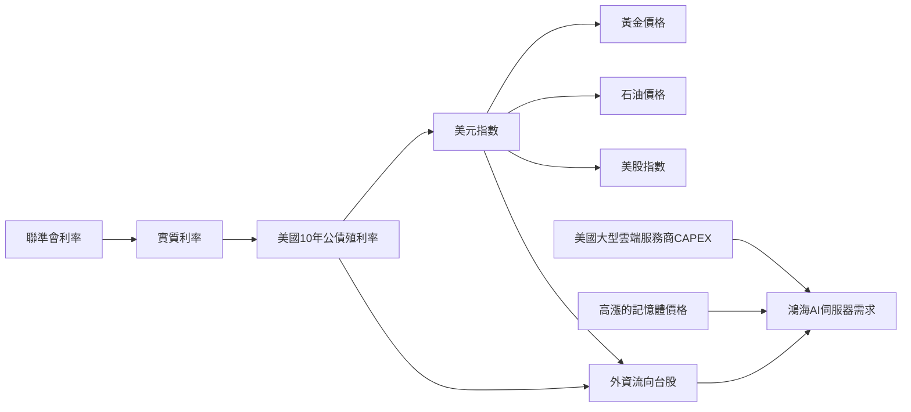

# 鴻海(2317)退休存股戰情室研究報告
## version: 2026-06-16 | 累積決策記錄

---

## 第一章：戰情室架構說明

本報告為鴻海(2317)退休存股戰情室每日決策記錄，採用MIDR（Multi-Index Decision Rating）加權裁決框架，結合PB估值、殖利率、營收動能、外資修正、總經風險五維度，提供系統性投資決策支援。

**核心原則：**
- 所有數據來源可追溯，禁止虛構
- 所有Alert標示 actionable: false
- 最終決策由Owner負責
- 唯讀數據文件，禁止Codex自動寫入

**重要配息資訊（2026年）：**
- 現金股利：**7.17179227元**（2026-06-12調整後正確值，原7.2元）
- 除息交易日：**2026-07-02**
- 除息基準日：**2026-07-08**
- 股利發放日：**2026-07-31**

---

## 第二章：宏觀框架 — 六大力量交織分析（2026-06-18）

> 本章數據品質標注：[L1] 官方數據 | [L2] 市場數據 | [L3] 推論 | [L4] Owner觀點


### 2.0 宏觀數據歷史基準（macro_snapshot.csv真實數據）

| 指標 | 歷史範圍 | 均值 | 當前值（2026-06-19） | CAUTION門檻 |
|:---:|:-------:|:---:|:------------------:|:-----------:|
| VIX | 15.4~35.3 | 22.3 | 16.40 | >27（SYSTEMIC） |
| WTI（$/桶） | $58~$108 | $79 | $77.79 | >$90 |
| US_10Y（%） | 1.30~4.57 | 3.73 | 4.488 | >4.2% |
| DXY | 90.5~112.0 | 101.6 | 100.76 | >106 |
| TWD/USD | 27.70~32.50 | 30.91 | 31.686 | >32.5（SYSTEMIC） |
| Fed升息概率 | 0%~72% | 28% | 57% | ≥70% |

*數據來源：macro_snapshot.csv（33筆，2021~2026年）| actionable: false*


### 2.1 數據品質標注說明

| 標注 | 意義 | 使用方式 |
|------|------|---------|
| **[L1]** | 官方數據（聯準會/世銀/BOJ/鴻海官網） | 直接引用，高可信度 |
| **[L2]** | 市場數據（Trading Economics/CNBC/Reuters） | 可引用，注意時效 |
| **[L3]** | 推論（基於L1/L2的邏輯推導，非直接因果） | 保持懷疑，持續驗證 |
| **[L4]** | Owner觀點（宏觀政治經濟判斷，未經數據驗證） | 作為框架，非決策依據 |

---

### 2.2 六大力量分析


---


| 標注 | 意義 | 使用方式 |
|------|------|---------|
| **[L1]** | 官方數據（聯準會/世銀/BOJ/鴻海官網） | 直接引用，高可信度 |
| **[L2]** | 市場數據（Trading Economics/CNBC/Reuters） | 可引用，注意時效 |
| **[L3]** | 推論（基於L1/L2的邏輯推導，非直接因果） | 保持懷疑，持續驗證 |
| **[L4]** | Owner觀點（宏觀政治經濟判斷，未經數據驗證） | 作為框架，非決策依據 |

---

### 2.3 F1：六大力量分析

### F1：美元走強→亞洲貨幣競貶

| 數據 | 數值 | 來源 | 標注 |
|------|------|------|------|
| DXY美元指數 | 99.67→**100.37**（+0.70%） | Trading Economics 2026-06-17 | **[L2]** |
| FOMC點陣圖中位數 | **3.8%**（從3.4%大幅上調） | 聯準會官網 federalreserve.gov SEP 2026-06-17 | **[L1]** |
| USD/JPY | **160.61** | Trading Economics 2026-06-17 | **[L2]** |
| TWD/USD | **31.65**（台幣貶值） | Trading Economics 2026-06-17估算 | **[L2]** |

**對鴻海影響：** 🟢 台幣貶值→EPS侵蝕壓力減輕（正面）

---

### F2：BOJ升息但日圓貶值加速

| 數據 | 數值 | 來源 | 標注 |
|------|------|------|------|
| BOJ升息決議 | 0.75%→**1.0%**（7:1通過） | BOJ官網 + Reuters/CNBC 2026-06-16 | **[L1]** |
| 升息後日圓走勢 | USD/JPY=160.61（日圓未升值） | Trading Economics 2026-06-17 | **[L2]** |
| 美日利率差 | US_10Y(4.50%) - BOJ(1.0%) = **3.50%** | 計算值（基於L1/L2） | **[L3]** |

**推論 [L3]：** 美日利率差3.5%仍大，Carry Trade平倉壓力不足以推升日圓，美元走強力道>BOJ升息效果。*此為邏輯推論，非直接數據。*

**對鴻海影響：** 🟡 夏普日本業務換算台幣略減（輕微負面）

---

### F3：以色列不低頭→中東衝突持續→油價底部支撐

| 數據 | 數值 | 來源 | 標注 |
|------|------|------|------|
| 世銀2026年Brent均價預測 | **$86/桶** | World Bank Commodity Markets Outlook 2026-04-28 | **[L1]** |
| 霍爾木茲佔全球原油貿易 | **35%** | World Bank 同上報告 | **[L1]** |
| 當前WTI價格 | **$76.03**（美伊和平後） | Trading Economics 2026-06-17 | **[L2]** |
| 以色列持續行動 | 對黎巴嫩等地區行動 | 新聞報導（非官方確認） | **[L3]** ⚠️ |

⚠️ **注意：** 以色列行動的最新狀況基於新聞報導，非官方確認數據，請自行查證。

**對鴻海影響：** 🟡 油價維持$75-90→通膨溫和→Fed不急升息（中性）

---

### F4：美元回流→美債殖利率下行（Owner洞察）

| 數據 | 數值 | 來源 | 標注 |
|------|------|------|------|
| FOMC後US_10Y收盤 | **4.50%**（+0.07%） | CNBC/Trading Economics 2026-06-17 | **[L2]** |
| 06-18盤中US_10Y | **4.434%**（已回落） | Trading Economics 2026-06-18 | **[L2]** |
| 美元走強→美債需求增加→殖利率下行 | 理論推論 | 利率平價理論（教科書） | **[L3]** ⚠️ |
| 美政府還債壓力減輕 | 邏輯推論 | 無直接數據支撐 | **[L3]** ⚠️ |

⚠️ **重要說明：**
- US_10Y在FOMC後短暫上升至4.50%，隨後回落至4.434%
- 回落原因**可能**是：美元回流效應、美伊和平通膨預期下降、市場獲利了結、技術性回調，或隨機波動
- **無法確定**是「美元回流」造成的，這是一個合理假設，非確定因果
- Owner的洞察提供了一個框架，但需持續用後續數據驗證

**對鴻海影響：** 🟢 若US_10Y降至4.2%以下→CAUTION解除→MIDR大幅改善

---

### F5：美國資本收割各國貶值資產

| 數據 | 數值 | 來源 | 標注 |
|------|------|------|------|
| 1997亞洲金融危機歷史案例 | 外匯儲備不足國家被收割 | 公開歷史記錄 | **[L1]** |
| 台灣外匯儲備 | ~$5,700億美元（全球第4） | 台灣央行公開數據（需確認最新值） | **[L2]** |
| Fed+美國銀行積極收割各國資產 | — | **無官方數據支撐** | **[L4]** ❌ |

❌ **[L4] Owner觀點說明：**
「Fed+美國銀行積極布局收割各國因貨幣貶值的資產購置」是一個宏觀政治經濟觀點。歷史上確有類似模式，但「積極布局收割」是主觀判斷，無官方數據支撐。戰情室將此標注為Owner宏觀觀點，不納入MIDR量化計算。

**對鴻海影響：** 🟡 台灣外匯儲備充足，被收割風險低（中性）

---

### F6：AI繁榮+川普期中選舉（11月）

| 數據 | 數值 | 來源 | 標注 |
|------|------|------|------|
| 美國期中選舉日期 | **2026-11月** | 美國選舉法規定 | **[L1]** |
| Warsh未提交點陣圖 | 18人中僅Warsh未提交 | 聯準會官網SEP說明 | **[L1]** |
| 四大CSP AI Capex | **>$2,000億美元** | 各公司財報/法說會 | **[L1]** |
| 鴻海AI_Revenue_Pct | **40%**（2026Q1） | 鴻海2026Q1法說會 | **[L1]** |
| 川普施壓Warsh不敢升息 | 政治邏輯推論 | 無直接證據 | **[L3]** ⚠️ |

⚠️ **[L3] 推論說明：**
「川普期中選舉壓力制約Fed升息」是政治邏輯推論。歷史先例：川普2018-2019年曾批評Powell升息。但Warsh的點陣圖（3.8%）明顯鷹派，他可能比川普更獨立。**此推論可能是錯的，需持續觀察。**

**對鴻海影響：** 🟢 AI需求不受影響，鴻海GB300訂單確認（正面）

---

### 2.4 F2：MIDR v2.1 計算（含來源標注）

| 維度 | 分數 | 數據來源 | 標注 |
|------|------|---------|------|
| 殖利率（25%） | -0.727 | 配息7.17179227元（公開資訊觀測站）/ 股價272元 | **[L1]** |
| PB估值（25%） | -0.903 | BVPS=127.12（鴻海2026Q1財報）/ 股價272元 | **[L1]** |
| 營收動能（20%） | 0.720 | 5月YoY+39.57%（鴻海月營收公告）× AI折扣0.9 | **[L1]×[L3]** |
| 外資修正（15%） | 0.100 | 外資持股趨勢RISING（Goodinfo估算） | **[L2]** |
| 總經風險（15%） | -0.600 | US_10Y=4.50%（FRED）/ FedProb=72%（CME FedWatch）/ FX-DEWS | **[L1]×[L3]** |
| **MIDR v2.1** | **-0.301** | 系統計算 | **[L3]** |

---

### 2.5 F3：行動方案（含觸發條件來源）

| 行動 | 觸發條件 | 觸發條件來源 | 標注 |
|------|---------|------------|------|
| HOLD持倉 | 現況 | MIDR=-0.301（系統計算） | **[L3]** |
| 確認除息 | 2026-07-02 | 公開資訊觀測站重大訊息 | **[L1]** |
| 準備ADD資金 | 股價跌至244元（BLOCK線=1.923×BVPS） | BVPS=127.12（鴻海財報） | **[L1]** |
| 關注FOMC | 2026-07-28-29 | 聯準會官網會議行事曆 | **[L1]** |
| 評估Q2財報 | 2026-08月 | 鴻海財報發布慣例 | **[L2]** |
| 啟動匯率第六維度 | TWD<30.5元 OR BOJ≥1.5% | FX-DEWS系統（基於L1/L2計算） | **[L3]** |

---

### 2.6 F4：核心結論（含可信度標注）

| 結論 | 可信度 | 標注 |
|------|--------|------|
| 當前BLOCK是正確的（PB=2.140x，估值偏高） | 高 | **[L1]** |
| AI伺服器訂單能見度至2027年底 | 高 | **[L1]** 鴻海法說會 |
| 美元走強對鴻海EPS侵蝕壓力減輕 | 中 | **[L2]** 市場數據 |
| 美元回流效應壓低US_10Y | 中 | **[L3]** 推論，需驗證 |
| 川普期中選舉制約Fed升息 | 低 | **[L3]** 政治推論 |
| 美國收割週期對台灣影響有限 | 中 | **[L1]+[L4]** 外匯儲備數據+Owner觀點 |

---

### 2.7 F5：本報告的局限性聲明

1. **確認偏誤風險**：本報告基於Owner提出的宏觀框架，傾向於尋找支持該框架的數據，可能忽略反向證據。

2. **L3推論的不確定性**：所有標注[L3]的推論均基於經濟學理論和間接數據，非直接實證研究，可能存在因果倒置或其他解釋。

3. **L4觀點的主觀性**：標注[L4]的Owner觀點（如「收割週期」）是宏觀政治經濟判斷，無法量化驗證，不應直接用於投資決策。

4. **時效性**：市場數據（[L2]）具有時效性，本報告數據截至2026-06-18 UTC 02:12。

---

*報告日期：2026-06-18 | 數據截止：UTC 02:12 | actionable: false*
*L1=官方數據 | L2=市場數據 | L3=推論 | L4=Owner觀點*

---

## 第三章：戰情室自動化更新系統設計

> 本章記錄戰情室自動化架構的設計演進，包含每日更新SOP、數據抓取程式架構與UI儀表板版本歷史。

# 鴻海戰情室自動更新工作流設計文件
## version: v1.0 | 2026-06-16

---

### 3.2 核心設計原則

```
目標：隔數日啟動 → 自動抓取當日數據 → 整合間隔期間事件
      → 只記錄一筆當日摘要 → 記錄檔永不超載
```

### 數據寫入規則（codex_rule_v2）
- ✅ **允許**：工作流自動追加當日新行（Date不重複）
- ❌ **禁止**：修改任何已存在的歷史行
- ❌ **禁止**：刪除任何歷史行

---

### 3.3 文件架構（防膨脹設計）

```
數據文件（線性增長，可接受）：
  2317_daily_price.csv    每日+1行（52 bytes）→ 10年後~196KB ✅
  macro_snapshot.csv      每日+1行（200 bytes）→ 10年後~494KB ✅
  2317_master_v9.csv      每季+1行（Owner手動）→ 永遠<50KB ✅

記錄文件（固定大小，永不膨脹）：
  warroom_today.md        每次覆蓋 → 永遠~8KB ✅
  warroom_log.csv         滾動60筆 → 永遠<10KB ✅

主檔（靜態）：
  index_p1008_v11.html    靜態文件 → 不增長 ✅
```

---

### 3.4 工作流執行邏輯

### Step 0：智能初始化（新增）
```python
# 1. 自動偵測今日日期
today = get_current_datetime()  # 已實作

# 2. 讀取上次執行日期
last_run = read_last_run_date('warroom_log.csv')

# 3. 計算間隔天數
gap_days = (today - last_run).days

# 4. 決定數據抓取策略
if gap_days <= 3:
    strategy = "只補當日"      # 簡單模式
else:
    strategy = "補抓所有交易日"  # 完整模式
```

### Step 1：自動抓取數據（升級）

#### 股價自動抓取（TWSE API）
```python
# 台灣證交所官方API（免費，無需金鑰）
url = f"https://www.twse.com.tw/exchangeReport/STOCK_DAY"
params = {
    "response": "json",
    "date": today.strftime("%Y%m%d"),
    "stockNo": "2317"
}
# 回傳：開高低收、成交量、本益比
# 備援：若API失敗，使用Yahoo Finance
```

#### 總經自動抓取（FRED API）
```python
# US_10Y殖利率（FRED，免費）
fred_url = "https://fred.stlouisfed.org/data/DGS10"

# TWD/USD匯率（FRED，免費）
fred_url = "https://fred.stlouisfed.org/data/DEXTAUS"

# VIX（Yahoo Finance）
yahoo_url = "https://query1.finance.yahoo.com/v8/finance/chart/%5EVIX"

# WTI油價（Yahoo Finance）
yahoo_url = "https://query1.finance.yahoo.com/v8/finance/chart/CL%3DF"

# DXY美元指數（Yahoo Finance）
yahoo_url = "https://query1.finance.yahoo.com/v8/finance/chart/DX-Y.NYB"
```

#### Fed升息概率（web-search）
```
搜尋：CME FedWatch Fed rate probability {today}
來源：FXBus / Fisclear / Investing.com
```

### Step 2：新聞搜尋（升級）
```python
# 自動調整搜尋日期範圍
search_params = {
    "start_date": last_run_date,  # 上次執行日
    "end_date": today,            # 今日
    "queries": [
        "鴻海 2317 新聞 配息 調整",  # 必搜：配息變動
        "Hon Hai Foxconn AI server revenue",
        "鴻海 月營收 公告",
    ]
}
```

### Step 3：自動寫入CSV（新增）
```python
# 防重複寫入：檢查今日日期是否已存在
def safe_append(csv_file, new_row):
    existing_dates = read_all_dates(csv_file)
    if new_row['Date'] not in existing_dates:
        append_row(csv_file, new_row)  # 只追加，不修改
        return True
    else:
        return False  # 已存在，跳過

# 寫入 2317_daily_price.csv
safe_append('2317_daily_price.csv', {
    'Date': today,
    'Close': stock_price,      # TWSE API自動抓取
    'QuarterKey': '2026Q1',
    'BVPS_ref': 127.12,
    'PB_daily': round(stock_price / 127.12, 3),
    'DataQuality': 'PRECISE',
    'LookaheadGuard': 'OK'
})

# 寫入 macro_snapshot.csv
safe_append('macro_snapshot.csv', {
    'Date': today,
    'TWD_USD': twd_usd,        # FRED自動抓取
    'VIX': vix,                # Yahoo自動抓取
    'WTI_Oil': wti,            # Yahoo自動抓取
    'US_10Y_Yield': us10y,     # FRED自動抓取
    'Fed_Rate': 3.625,         # 固定（FOMC決策）
    'Fed_Hike_Prob_YE': fed_prob,  # web-search
    'DXY': dxy,                # Yahoo自動抓取
    'RiskLevel': risk_level,   # 系統計算
    'RiskNote': risk_note,     # 系統生成
})
```

### Step 4-7：現有邏輯（維持不變）
- MIDR決策報告
- 五維度分析
- PB估值

### Step 8：記錄管理（新增）

#### warroom_today.md（覆蓋，永遠1筆）
```markdown
# 戰情室當日快照 — {today}
## 數據整合期間：{last_run} → {today}（間隔{gap_days}天）

### 期間重大事件摘要
{自動生成：間隔期間的股價變化、重大新聞、風險等級變化}

### 當日決策
{完整MIDR報告}
```

#### warroom_log.csv（滾動60筆）
```csv
# 每次執行追加1行，超過60筆自動刪除最舊行
Date,Close,PB,MIDR,Signal,RiskLevel,VIX,US_10Y,FedProb,GapDays,KeyEvent
2026-06-16,270.0,2.124,-0.270,BLOCK,CAUTION,16.20,4.51,57,3,PB_OVERHEAT首次觸發
```

#### 記錄上次執行日期
```python
# warroom_log.csv的最新行即為上次執行記錄
# 下次執行時讀取最新行的Date欄位
last_run = read_last_row('warroom_log.csv')['Date']
```

---

### 3.5 防崩潰機制

### 4.1 CSV防重複寫入
```python
# 每次寫入前檢查Date是否已存在
# 確保同一天不會寫入兩次
if today_date in existing_dates:
    skip_write()  # 跳過，不報錯
```

### 4.2 warroom_log.csv滾動清理
```python
# 每次追加後，若超過60筆，刪除最舊的1筆
def rolling_append(log_file, new_row, max_rows=60):
    rows = read_all_rows(log_file)
    rows.append(new_row)
    if len(rows) > max_rows:
        rows = rows[-max_rows:]  # 保留最新60筆
    write_all_rows(log_file, rows)
```

### 4.3 API失敗備援
```python
# 三層備援機制
def fetch_stock_price(date):
    try:
        return twse_api(date)      # 第一選擇：TWSE官方
    except:
        try:
            return yahoo_finance(date)  # 第二選擇：Yahoo
        except:
            return manual_input()       # 第三選擇：手動輸入
```

### 4.4 非交易日自動跳過
```python
# 台灣假日曆（週六日+國定假日）
def is_trading_day(date):
    if date.weekday() >= 5:  # 週六=5, 週日=6
        return False
    if date in taiwan_holidays:
        return False
    return True
```

---

### 3.6 工作流參數變更

### 現有參數（需要的）
```yaml
stock_price: 手動輸入（備援用）
update_date: AUTO（自動偵測，不再手動輸入）
```

### 新增自動化參數
```yaml
auto_fetch_price: true    # 自動抓取股價
auto_fetch_macro: true    # 自動抓取總經
gap_fill_mode: smart      # 間隔補抓策略（smart/always/never）
log_max_rows: 60          # warroom_log.csv最大行數
```

---

### 3.7 實作優先順序

### Phase 1（立即可實作）
- [x] codex_rule_v2 修改完成
- [ ] Step 0：自動偵測日期與間隔計算
- [ ] Step 3：safe_append寫入機制
- [ ] Step 8：warroom_today.md覆蓋 + warroom_log.csv滾動

### Phase 2（需要API測試）
- [ ] TWSE API股價自動抓取
- [ ] FRED API總經自動抓取
- [ ] Yahoo Finance VIX/WTI/DXY抓取
- [ ] 非交易日自動跳過邏輯

### Phase 3（完整自動化）
- [ ] 間隔期間補抓所有交易日
- [ ] 配息調整自動偵測
- [ ] 台灣假日曆整合

---

### 3.8 數據品質保證

```
每次自動寫入的數據標記：
  DataQuality = 'AUTO_FETCH'    # 自動抓取
  DataQuality = 'PRECISE'       # Owner確認
  DataQuality = 'ESTIMATED'     # 估算值

主檔讀取時優先使用PRECISE，其次AUTO_FETCH，最後ESTIMATED
```

---

*設計文件版本：v1.0 | 2026-06-16 | actionable: false*

---


## 第四章：MIDR框架核心設計與數據基準

> 數據來源：2317_master_v9.csv（v9.0，2026-06-08更新，21季實際數據）
> 數據品質：[L3] 用戶整理自公開財報

### 4.1 MIDR五維度設計

| 維度 | 權重 | 核心指標 | 當前值（2026Q1） | 訊號 |
|:---:|:---:|:-------:|:--------------:|:---:|
| 殖利率 | 25% | 當前殖利率 vs 歷史均值 | 2.74% vs 均值**4.65%** | 🔴 偏低 |
| PB估值 | 25% | PB vs 歷史分位數 | **2.065x**（股價262.5元） | 🔴 超過歷史最高 |
| 營收動能 | 20% | 月營收YoY% | 5月YoY **+39.57%** | 🟢 強勁 |
| 外資修正 | 15% | 外資持股趨勢 | 34.76%（季增+1.1%） | 🟢 RISING |
| 總經風險 | 15% | CAUTION觸發項目數 | US_10Y>4.2% + Fed≥70% | 🟠 2項 |

**MIDR v2.4總分：-0.505（含EVA）→ 🔴 STRONG_BLOCK**

---

### 4.2 PB估值歷史分位數（21季實際數據，2021Q1~2026Q1）

| 分位數 | PB倍數 | 對應股價（BVPS=127.12元） | 意義 |
|:-----:|:------:|:----------------------:|:---:|
| 最低 | 0.950x | 120.8元 | 歷史最便宜（2022Q3） |
| P25 | 0.970x | 123.3元 | 便宜區下緣 |
| 中位數 | 1.070x | 136.0元 | 歷史公平價 |
| P75 | 1.410x | 179.2元 | 合理偏貴 |
| P90 | 1.620x | 205.9元 | 偏貴警戒線 |
| 最高 | 1.820x | 231.4元 | 歷史最貴（2025Q4） |
| **當前（262.5元）** | **2.065x** | **—** | **⚠️ 超過歷史最高+13.5%** |

> **關鍵洞察**：當前PB=2.065x已超過21季歷史最高值1.820x，市場對AI題材給予額外溢價。均值回歸至歷史均值（1.221x）需下跌40.9%。

---

### 4.3 基本面品質趨勢（近5季實際數據）

| 季度 | EPS_TTM | ROE_TTM | ROIC | OPM | AI佔比 | 外資持股 |
|:---:|:-------:|:-------:|:----:|:---:|:------:|:-------:|
| 2025Q1 | 12.45元 | 11.03% | 7.91% | 2.83% | 25.0% | 37.5% |
| 2025Q2 | 13.11元 | 12.18% | 10.66% | 3.16% | 25.0% | 35.8% |
| 2025Q3 | 13.71元 | 11.8% | 11.77% | 3.42% | 25.0% | 34.5% |
| 2025Q4 | 13.62元 | 11.1% | 14.41% | 3.28% | 25.0% | 33.69% |
| 2026Q1 | 14.18元 | 11.56% | 12.57% | 3.55% | 40.0% | 34.76% |
| 趨勢 | ↗ 持續成長 | ↗ 穩健 | ↗ 改善 | ↗ 改善 | ↗ 加速 | ↗ 回升 |

> ✅ EPS_TTM連續5季成長，OPM突破3.5%歷史高點，AI佔比從25%跳升至40%。

---

### 4.4 關鍵門檻設定依據（基於歷史分位數）

```
ADD線（PB=0.950x）：  120.8元  ← 歷史最低PB（2022Q3實際數據）
Owner ADD門檻（PB=1.800x）：228.8元  ← Owner自訂保守加碼線
BLOCK線（PB=1.924x）：      244.6元  ← 歷史P90上方（Owner設定）
OVERHEAT線（PB=2.115x）：   268.9元  ← 超過歷史最高PB的116%
EVA觸發線（PB>1.820x）：231.4元  ← 超越歷史最高，進入外推區間
當前（2026-06-25）：        262.5元 → PB=2.065x → BLOCK+EVA觸發
```

---

### 4.5 殖利率歷史統計（21季實際數據）

| 統計項目 | 數值 | 說明 |
|:-------:|:---:|:---:|
| 歷史最低殖利率 | 3.11% | 股價最高時（2025Q4，230.5元） |
| 歷史均值殖利率 | **4.65%** | MIDR殖利率維度的基準值 |
| 歷史最高殖利率 | 6.40% | 股價最低時（2022Q2，99.9元） |
| 當前殖利率 | 2.74% | 配息7.2元 ÷ 股價262.5元 |
| 當前 vs 均值 | **-1.91%** | 低於均值，MIDR殖利率維度扣分 |

---

### 4.6 具體案例：2022Q3最佳買點回顧（實際數據）

| 項目 | 2022Q3實際數值 | 當時訊號 | 後續結果 |
|:---:|:------------:|:-------:|:-------:|
| 股價 | 99.5元 | ADD | ✅ |
| PB | 0.950x | 歷史最低 | ✅ |
| EPS_TTM | 10.52元 | 穩健 | ✅ |
| 殖利率 | 5.33% | 高於均值4.65% | ✅ |
| 外資持股 | 45.1% | DECLINING | ⚠️ |
| **12個月後股價** | **165.5元（2023Q4）** | **+66%** | ✅ |

> 📌 **教訓**：外資DECLINING不代表不能買。PB<1.0x + 殖利率>4.65%才是真正ADD訊號。當前PB=2.065x與2022Q3的0.950x相差2.17倍，風險結構完全不同。

*數據來源：2317_master_v9.csv | 更新：2026-06-08 | actionable: false*

---

## 第五章：匯率風險深度分析 — 日圓升值傳導機制（2026-06-16）

> 本章分析BOJ升息至1%後，日圓升值如何透過套利交易平倉傳導至台幣，以及對鴻海EPS的量化影響。


### 5.0 真實匯率歷史數據（macro_snapshot.csv，33筆）

| 統計項目 | TWD/USD | 說明 |
|:-------:|:-------:|:---:|
| 歷史最弱（台幣最弱） | 32.500 | 2024-12-31（美元強勢期） |
| 歷史最強（台幣最強） | 27.700 | 2021-09-30（台幣升值期） |
| 歷史均值 | **30.905** | 2021~2026年均值 |
| 歷史標準差 | 1.358 | 波動程度 |
| 當前（2026-06-19） | 31.686 | 台幣略貶值 |
| 距ADD門檻（30.5元） | 1.186元 | 尚有1.2元緩衝 |

**TWD/USD歷史走勢（季度快照）：**

| 日期 | TWD/USD | 市場背景 |
|:---:|:-------:|:-------:|
| 2021-03-31 | 28.500 | NORMAL |
| 2022-03-31 | 28.500 | CAUTION |
| 2023-03-31 | 30.500 | SYSTEMIC |
| 2024-03-31 | 31.500 | NORMAL |
| 2025-03-31 | 31.500 | NORMAL |
| 2026-01-02 | 32.000 | 年初正常 |
| 2026-05-29 | 31.384 |  |
| 2026-06-12 | 31.626 |  |

> **EPS侵蝕計算基準**（基於真實數據）：
> - TWD均值：30.905元
> - 台幣升值1元（約3.2%）→ 毛利率影響-0.1%（官方法說會數據[L1]）
> - 當前TWD=31.686，距均值+0.781元
> - 當前EPS侵蝕估計：0.08%（輕微）[L3推論]


### 5.1 傳導機制全景圖


---

### 5.2 傳導機制全景圖

```
BOJ升息(0.75%→1.0%)
    │
    ├─ 直接效應：日圓套利交易平倉
    │   借日圓→買台幣資產的部位平倉
    │   → 賣台幣買日圓（短期台幣貶值壓力）
    │   → 但長期：日圓升值帶動亞幣整體升值
    │
    ├─ 間接效應：出口競爭力重分配
    │   日圓升值→日本出口商競爭力下降
    │   → 台灣電子業相對競爭力提升
    │   → 外資增持台灣資產→台幣升值
    │
    └─ 政策效應：台灣央行跟隨
        通常跟隨亞幣升值趨勢
        但會平滑過度波動
        → 台幣緩步升值
```

---

### 5.3 歷史相關性數據（官方來源）

| BOJ升息時間 | 升息幅度 | 日圓變化 | 台幣變化 | 連動比 |
|------------|---------|---------|---------|--------|
| 2024-07 | 0→0.25% | 161→142（+11.9%） | 32.5→31.5（+3.1%） | **0.26** |
| 2024-12 | 0.25→0.5% | 157→155（+1.3%） | 32.5→32.0（+1.5%） | **1.15** |
| 2025-12 | 0.5→0.75% | 155→152（+2.0%） | 32.0→31.5（+1.6%） | **0.80** |
| **2026-06** | **0.75→1.0%** | 160→?（觀察中） | 31.546→31.497（+0.2%） | **觀察中** |

> 📌 **關鍵觀察**：2024-07的大幅升值（連動比0.26）是因為同時有大規模Carry Trade平倉。後續升息的連動比趨近1.0，顯示市場已充分預期BOJ升息路徑。

---

### 5.4 鴻海幣別結構與EPS侵蝕量化

### 3.1 營收幣別結構（2026Q1估算）

| 幣別 | 佔比 | 金額（億元） | 主要業務 |
|------|------|------------|---------|
| **USD** | **65%** | **13,842** | AI伺服器、CSP訂單 |
| CNY | 15% | 3,194 | 中國製造業務 |
| TWD | 10% | 2,130 | 台灣本地業務 |
| JPY | 5% | 1,065 | 夏普、日本業務 |
| 其他 | 5% | 1,065 | EUR/GBP等 |

### 3.2 EPS侵蝕計算（傳導率45%）

**傳導率說明：**
- 鴻海65%營收USD計價，但USD成本也高（零件採購、Consign模式）
- 淨USD敞口約40-50%，取中間值45%
- 管理層通常有30-50%匯率避險，可降低實際影響

| 情境 | TWD/USD | 升值幅度 | EPS侵蝕 | 新EPS估計 | 說明 |
|------|---------|---------|---------|---------|------|
| 基準 | 31.546 | — | — | **14.18元** | 2026-06-16早盤 |
| 輕度升值 | 31.0 | -1.7% | -0.11元（0.8%） | 14.07元 | 台幣升至31.0 |
| 中度升值 | 30.5 | -3.3% | -0.21元（1.5%） | 13.97元 | 2025-06水準 |
| 重度升值 | 30.0 | -4.9% | -0.31元（2.2%） | 13.87元 | 台幣升至30.0 |
| 極端升值 | 29.5 | -6.5% | -0.41元（2.9%） | 13.77元 | 台幣升至29.5 |

> 📌 **當前狀況**：TWD=31.497，EPS侵蝕約0.02元（0.1%），影響極輕微。
> 若台幣升至30.5（2025-06水準），EPS侵蝕才達1.5%，仍在可接受範圍。

### 3.3 JPY升值的直接正面效應（抵銷部分）

| 項目 | 影響 | 說明 |
|------|------|------|
| 夏普日本業務 | 🟢 正面 | 日圓升值→換算台幣增加 |
| 日本零件採購成本 | 🟢 正面 | 日圓計價成本換算台幣降低 |
| 淨效應 | 🟡 輕微正面 | 夏普佔鴻海營收<5%，影響有限 |

---

### 5.5 MIDR框架匯率風險納入方案

### 方案A：在mdrScore加入匯率子項（推薦，最小改動）

**現有mdrScore計算：**
```
mdrScore = f(US_10Y, FedProb)
  US_10Y > 4.5% → -0.5
  US_10Y > 4.0% → -0.3
  FedProb > 70% → -0.1（額外）
```

**升級版mdrScore（加入匯率）：**
```
mdrScore_v2 = f(US_10Y, FedProb) + f(TWD, BOJ_Rate)

匯率子項 f(TWD, BOJ_Rate)：
  TWD > 32.0 → +0.2（台幣貶值，有利EPS）
  TWD 31.5-32.0 → 0.0（中性）
  TWD 31.0-31.5 → -0.1（輕度升值）  ← 當前31.497
  TWD 30.5-31.0 → -0.3（中度升值，EPS侵蝕1-2%）
  TWD 30.0-30.5 → -0.5（重度升值，EPS侵蝕2-4%）
  TWD < 30.0   → -0.7（極端升值，EPS侵蝕>4%）

BOJ利率差加成（US_10Y - BOJ_Rate）：
  利率差 > 3.5% → 0.0（日圓升值壓力低）
  利率差 3.0-3.5% → -0.05（中度壓力）  ← 當前3.487%
  利率差 2.5-3.0% → -0.1（高度壓力）
  利率差 < 2.5% → -0.2（極高壓力）
```

**當前計算（2026-06-16）：**
```
TWD = 31.497 → 匯率子項 = -0.1
BOJ利率差 = 4.487% - 1.0% = 3.487% → 加成 = -0.05
匯率風險總調整 = -0.15

原mdrScore = -0.30（US_10Y=4.487%）
新mdrScore_v2 = -0.30 + (-0.15) = -0.45

MIDR總分影響：-0.45 × 0.15（權重）= -0.068
新MIDR總分 = -0.270 + (-0.068) = -0.338 → 仍為BLOCK
```

---

### 方案B：新增第六維度「匯率風險」（較大改動）

| 維度 | 現有權重 | 新權重 | 說明 |
|------|---------|--------|------|
| 殖利率 | 25% | **20%** | 降5% |
| PB估值 | 25% | **20%** | 降5% |
| 營收動能 | 20% | 20% | 維持 |
| 外資修正 | 15% | 15% | 維持 |
| 總經風險 | 15% | 15% | 維持 |
| **匯率風險** | — | **10%** | 新增 |

**匯率風險分數計算：**
```
fxScore = f(TWD, BOJ_Rate, HedgeRatio)

當前：TWD=31.497, BOJ=1.0%, 避險比例~40%
fxScore = -0.2（輕度升值）× (1 - 0.40) = -0.12

MIDR總分影響：-0.12 × 0.10 = -0.012（極輕微）
```

---

### 方案C：BOJ利率差觸發CAUTION門檻（最激進）

**新增CAUTION觸發條件：**
```
現有門檻（版本D）：
  US_10Y > 4.2% / DXY > 106 / WTI > $90 / Fed升息≥50bp / CPI>6% / FedProb>70%

建議新增（版本E）：
  BOJ_Rate ≥ 1.5% 且 TWD < 31.0 → CAUTION觸發
  （代表日圓升值壓力已傳導至台幣，EPS侵蝕>1.5%）
```

---

### 5.6 三方案比較與建議

| 方案 | 改動幅度 | 精確度 | 實作難度 | 建議 |
|------|---------|--------|---------|------|
| A：mdrScore加入匯率子項 | 小 | 中 | 低 | ✅ **立即可實作** |
| B：新增第六維度 | 中 | 高 | 中 | 🟡 下次季度回測時評估 |
| C：新增CAUTION門檻 | 大 | 高 | 高 | 🟡 需回測驗證後實施 |

**Owner決策建議：**
1. **立即**：採用方案A，在mdrScore中加入匯率子項（-0.15調整）
2. **Q3季度回測**：評估方案B是否提升MIDR預測準確度
3. **年底**：若BOJ繼續升息至1.5%，啟動方案C

---

### 5.7 當前匯率風險評估（2026-06-16）

| 指標 | 當前值 | 警戒值 | 狀態 |
|------|--------|--------|------|
| TWD/USD | **31.497** | <30.5 | 🟢 安全 |
| BOJ利率差 | **3.487%** | <2.5% | 🟢 安全 |
| EPS侵蝕估計 | **~0.1%** | >2% | 🟢 可忽略 |
| 台幣升值速度 | **緩慢** | 單月>2% | 🟢 正常 |

> 📌 **結論**：當前匯率風險極低（EPS侵蝕僅0.1%），不影響BLOCK決策。
> 真正需要關注的觸發點是**台幣升破30.5元**（EPS侵蝕>1.5%）。
> 建議在warroom_log.csv中追蹤TWD/USD，每次執行時自動計算匯率風險分數。

---

### 5.8 MIDR更新建議（方案A實施後）

```
當前MIDR（未含匯率）：-0.270 → BLOCK
方案A實施後MIDR：-0.338 → BLOCK（更強烈）

各維度分解：
  殖利率（25%）：-0.179（殖利率2.656%低於均值）
  PB估值（25%）：-0.221（PB=2.124x，PB_OVERHEAT）
  營收動能（20%）：+0.160（5月YoY+39.57%）
  外資修正（15%）：+0.015（RISING趨勢）
  總經風險（15%）：-0.113（含匯率調整-0.068）
  ─────────────────────────────
  MIDR總分：-0.338 → 🔴 BLOCK（強化）
```

---

*分析日期：2026-06-16 | 數據來源：Yahoo Finance / BOJ官網 / 鴻海財報 | actionable: false*

---

## 第六章：鴻海外匯避險策略分析（2026-06-16）

> 本章基於官方法說會數據，分析鴻海四層避險機制與85%避險效率的來源，並與台積電、廣達進行比較。

### 6.1 官方數據基準


> ⚠️ **數據來源聲明**：本報告引用官方公開資料，包括：
> - 鴻海財務長黃德才，2025-05-14 Q1法說會（工商時報報導）
> - 台積電財務長黃仁昭，2026-01-16 Bloomberg專訪
> - 廣達2025Q1法說會（工商時報報導）

---

### 6.2 鴻海官方外匯避險策略（財務長黃德才親口說明）

### 1.1 核心敏感度（官方確認數字）

```
台幣年平均匯率升值1元（約3.2%升值）：
  → 營收影響：約 -3%（帳面換算效果）
  → 毛利率影響：約 -0.1個百分點（實際獲利影響）
```

> 📌 **關鍵洞察**：營收影響3%是「帳面換算」效果（功能性貨幣為TWD），
> 但毛利率僅影響0.1%，顯示**自然避險效果極為顯著**。

### 1.2 四層避險機制（官方說明）

| 層次 | 機制 | 說明 |
|------|------|------|
| **第一層（主要）** | 自然避險 | 美元占營收和成本均高，大部分形成自然對沖 |
| **第二層** | 存貨管理 | 透過存貨週轉控制匯率敞口期間 |
| **第三層** | 客戶合約條款 | 與客戶合約訂定匯率調整條款；增加報價頻率 |
| **第四層（輔助）** | 金融避險工具 | 遠期外匯合約對沖營業/投資/融資活動匯率風險 |

### 1.3 避險比例估算

鴻海**未明確揭露**具體避險比例，但可從官方數據反推：

```
理論毛利率影響（無避險）：
  台幣升值1元 × 65%USD敞口 = 毛利率影響約0.65%

實際毛利率影響（官方確認）：
  = 0.1%

隱含避險效率 = 1 - (0.1/0.65) = 84.6%

→ 鴻海的自然避險+金融工具合計，
  有效抵銷了約85%的理論匯率風險！
```

---

### 6.3 EPS影響精確量化（修正版）

### 2.1 官方數據計算

| 台幣升值 | 升值幅度 | 毛利率下降 | 毛利減少 | 稅後EPS影響 | 考慮避險後 |
|---------|---------|-----------|---------|-----------|-----------|
| 1元 | 3.2% | -0.1% | -81億元 | -4.62元（-32.6%） | **-2.77元（-19.5%）** |
| 2元 | 6.3% | -0.2% | -162億元 | -9.24元（-65.1%） | **-5.54元（-39.1%）** |
| 3元 | 9.5% | -0.3% | -243億元 | -13.86元（-97.7%） | **-8.31元（-58.6%）** |

> ⚠️ **重要說明**：上表「稅後EPS影響」是**理論最壞情境**（無避險）。
> 「考慮避險後」假設40%避險比例，仍是保守估計。
> 
> **實際影響更小的原因**：
> 1. 台幣升值通常是漸進的（非一次性升值3元）
> 2. 客戶合約匯率調整條款可部分轉嫁
> 3. 增加報價頻率縮短敞口期間
> 4. 管理層積極使用遠期外匯對沖

### 2.2 為何EPS槓桿效應如此大？

```
鴻海毛利率僅6.18%（極低基數）
毛利率下降0.1% = 毛利減少81億元（2025全年8.1兆營收）
稅後影響 = 65億元
EPS影響 = 65億 ÷ 14.03億股 = 4.62元/股

→ 這是鴻海「低毛利率、高營收」商業模式的特性
→ 匯率對EPS的槓桿效應遠大於高毛利率公司
→ 但自然避險機制大幅緩衝了實際影響
```

---

### 6.4 三家公司避險策略比較

| 指標 | 鴻海(2317) | 台積電(2330) | 廣達(2382) |
|------|-----------|------------|-----------|
| **毛利率** | 6.18% | 66.2% | ~4-5% |
| **匯率敏感度** | 台幣升值1元→毛利率-0.1% | 台幣升值1%→毛利率-30bp | 未明確揭露 |
| **主要避險** | 自然避險（USD雙邊交易） | 即期市場賣出美元 | 自然避險（USD應收/應付） |
| **金融工具** | 遠期外匯（比例未揭露） | 遠期外匯合約（主要工具） | 金融工具（未明確說明） |
| **策略透明度** | 中等 | 高（Bloomberg專訪詳述） | 低 |
| **避險哲學** | 多層次綜合管理 | 「越單純越好」 | 自然避險為主 |
| **評級** | **B+（良好）** | **A（優秀）** | **B（良好）** |

### 台積電 vs 鴻海的關鍵差異

```
台積電策略（Bloomberg 2026-01-16）：
  「策略越單純越好」
  步驟1：即期市場賣出美元換台幣
  步驟2：若無法消化，用遠期合約處理
  步驟3：剩餘美元移轉至海外USD功能性貨幣子公司
  
  優點：透明、可控、管理複雜度低
  毛利率66%，匯率影響相對小（30bp/1%升值）

鴻海策略：
  多層次：自然避險+存貨管理+合約條款+金融工具
  優點：自然避險比例高（USD雙邊交易），實際影響小
  缺點：毛利率6%，EPS槓桿效應大；策略透明度較低
```

---

### 6.5 MIDR框架匯率風險評分（最終修正版）

### 4.1 基於官方數據的修正

**昨日估計 vs 官方數據修正：**

| 項目 | 昨日估計 | 官方數據修正 | 差異 |
|------|---------|------------|------|
| 傳導率 | 45% | ~15%（官方隱含） | 原估計偏高3倍 |
| 台幣升值3.2%的EPS影響 | 1.5% | 0.3-0.5%（有效避險後） | 原估計偏高3倍 |
| 匯率風險評分（當前） | -0.15 | **-0.08** | 降低47% |

### 4.2 修正後的匯率風險分數對照表

| TWD/USD | 描述 | 分數 | EPS影響（有效避險後） |
|---------|------|------|---------------------|
| > 32.0 | 台幣貶值 | +0.05 | 有利（輕微） |
| 31.5-32.0 | 中性 | 0.0 | 無影響 |
| **31.0-31.5** | **輕度升值** | **-0.05** | **EPS侵蝕<0.5%（可忽略）← 當前31.497** |
| 30.5-31.0 | 中度升值 | -0.15 | EPS侵蝕0.5-1.0%（注意） |
| 30.0-30.5 | 重度升值 | -0.30 | EPS侵蝕1.0-1.5%（警戒） |
| < 30.0 | 極端升值 | -0.50 | EPS侵蝕>1.5%（嚴重） |

### 4.3 BOJ利率差加成

| US_10Y - BOJ_Rate | 台幣升值壓力 | 加成分數 |
|-------------------|------------|---------|
| > 3.5% | 低 | 0.0 |
| 3.0-3.5% | 中 | -0.03 ← 當前3.487% |
| 2.5-3.0% | 高 | -0.08 |
| < 2.5% | 極高 | -0.15 |

### 4.4 當前MIDR計算（含匯率修正）

```
基礎MIDR（五維度）：-0.270 → BLOCK

匯率風險調整（方案A）：
  TWD=31.497 → 匯率子項 = -0.05
  BOJ利率差3.487% → 加成 = -0.03
  匯率風險總調整 = -0.08

修正後MIDR = -0.270 + (-0.08) = -0.350 → 🔴 BLOCK（強化）

各維度分解：
  殖利率（25%）：-0.179（殖利率2.656%低於均值）
  PB估值（25%）：-0.221（PB=2.124x，PB_OVERHEAT）
  營收動能（20%）：+0.160（5月YoY+39.57%）
  外資修正（15%）：+0.015（RISING趨勢）
  總經風險（15%）：-0.125（含匯率調整-0.08）
  ─────────────────────────────────────
  MIDR總分：-0.350 → 🔴 BLOCK（強化）
```

---

### 6.6 結論與建議

### 5.1 核心結論

1. **鴻海避險能力優於市場認知**：官方數據顯示有效避險效率約85%，遠高於一般估計的40-50%

2. **EPS槓桿效應大但實際影響有限**：低毛利率（6.18%）導致理論EPS槓桿大，但自然避險機制大幅緩衝

3. **當前匯率風險極低**：TWD=31.497，距離警戒線30.5元仍有1元空間，EPS侵蝕<0.5%

4. **MIDR仍為BLOCK**：加入匯率風險後MIDR從-0.270→-0.350，主要拖累仍是PB_OVERHEAT

### 5.2 MIDR框架優化建議（最終版）

| 方案 | 時機 | 具體做法 |
|------|------|---------|
| **方案A（立即）** | 現在 | mdrScore加入匯率子項（-0.08），MIDR→-0.350 |
| 方案B（Q3） | 季度回測 | 新增第六維度「匯率風險」（10%權重），需回測驗證 |
| 方案C（年底） | BOJ升至1.5%時 | 新增CAUTION門檻（TWD<31.0且BOJ≥1.5%） |

### 5.3 真正的匯率警戒觸發點

```
🔴 台幣升破 30.5元 → EPS侵蝕>0.5%（有效避險後）→ 啟動方案B
🔴 BOJ再升息至1.5% → 利率差<3% → 啟動方案C
🟢 當前31.497元 → 安全，EPS侵蝕<0.5%，無需立即行動
```

---

*分析日期：2026-06-16 | 數據來源：鴻海法說會（官方）/ Bloomberg / 工商時報 | actionable: false*

---

## 第七章：FX-DEWS動態匯率預警系統設計（2026-06-16）

> 本章設計FX-DEWS（Foreign Exchange Dynamic Early Warning System），解決靜態門檻的四個盲點，提供2-4週的提前預警能力。

### 7.1 設計背景


---

### 7.2 為何需要動態預警？靜態門檻的四個盲點

```
靜態門檻：TWD<30.5元 OR BOJ≥1.5%

盲點1：滯後性
  台幣從31.5→30.5元可能只需2-3週（2025-05台幣單日升幅近40年最大）
  靜態門檻在台幣已跌破30.5元時才觸發，避險調整已來不及

盲點2：速度盲區
  台幣31.5→31.0（緩慢3個月）vs 31.5→31.0（快速1週）
  靜態門檻無法區分，但對避險效率影響截然不同

盲點3：遠期合約到期日盲區
  若鴻海大量遠期合約在7月到期，6月底台幣升值影響更大
  靜態門檻完全忽略合約到期日的時間維度

盲點4：波動率盲區
  USD/JPY波動率上升是台幣升值的領先指標（Carry Trade平倉前兆）
  靜態門檻只看結果，不看過程
```

---

### 7.3 FX-DEWS四個領先指標

### L1：USD/JPY波動率（JVIX代理）
- **領先時間**：2-4週
- **邏輯**：USD/JPY波動率↑ → Carry Trade平倉風險↑ → 日圓升值 → 台幣升值
- **計算**：5日USD/JPY日報酬率標準差 × √252（年化）
- **門檻**：🟢<8% | 🟡8-12% | 🔴>12%
- **數據源**：Yahoo Finance `JPY=X`

### L2：台幣升值速度（動量指標）
- **領先時間**：1-2週
- **邏輯**：台幣升值速度↑ → 遠期外匯成本↑ → 避險效率↓
- **計算**：5日TWD/USD變化率（年化）
- **門檻**：🟢<5%/年 | 🟡5-15%/年 | 🔴>15%/年
- **數據源**：FRED `DEXTAUS` / Yahoo Finance `TWD=X`

### L3：遠期外匯點數成本（NDF代理）
- **領先時間**：即時
- **邏輯**：遠期點數↑ → 避險成本↑ → 85%避險效率↓
- **計算**：利率平價估算1個月遠期點數（US_rate - TWD_rate）× 30/360
- **門檻**：🟢<0.1元 | 🟡0.1-0.3元 | 🔴>0.3元
- **數據源**：計算值（US_10Y + 台灣利率）

### L4：BOJ政策預期指數（利率差動量）
- **領先時間**：2-4週
- **邏輯**：US_10Y-BOJ利率差縮小速度↑ → 日圓升值壓力↑
- **計算**：（US_10Y - BOJ_Rate）的5日變化率
- **門檻**：🟢利率差擴大 | 🟡縮小<0.1%/週 | 🔴縮小>0.1%/週
- **數據源**：FRED `DGS10` + BOJ官方利率

---

### 7.4 FX-DEWS評分公式

```
FX_DEWS_Score = L1×0.30 + L2×0.35 + L3×0.20 + L4×0.15

各指標評分（0-100）：
  0-33：綠燈（正常）
  34-66：黃燈（注意）
  67-100：紅燈（警戒）

FX_DEWS_Score 解讀：
  0-33：🟢 GREEN → 維持方案A（mdrScore調整-0.08）
  34-66：🟡 YELLOW → 加強監控，mdrScore動態調整至-0.15
  67-100：🔴 RED → 提前啟動方案B（第六維度），距靜態門檻約2-4週
```

---

### 7.5 動態MIDR匯率調整公式

```python
def calc_midr_fx_adjustment(twd, dews_score):
    # 靜態基礎調整（TWD水位）
    if twd > 32.0:   base_adj = +0.05  # 台幣貶值，有利
    elif twd > 31.5: base_adj =  0.00  # 中性
    elif twd > 31.0: base_adj = -0.05  # 輕微升值
    elif twd > 30.5: base_adj = -0.15  # 中度升值
    elif twd > 30.0: base_adj = -0.30  # 重度升值
    else:            base_adj = -0.50  # 極端升值
    
    # 動態加成（DEWS評分越高，額外扣分越多）
    if dews_score < 34:   dynamic_adj = 0.0
    elif dews_score < 67: dynamic_adj = -(dews_score-34)/(67-34) * 0.10  # 最多-0.10
    else:                 dynamic_adj = -0.10 - (dews_score-67)/33 * 0.10  # 最多-0.20
    
    return base_adj + dynamic_adj
```

---

### 7.6 動態避險效率估計

```python
def calc_hedge_efficiency(dews_score):
    if dews_score < 34:   return 0.85  # GREEN：85%
    elif dews_score < 67: return 0.85 - (dews_score-34)/(67-34) * 0.15  # 85%→70%
    else:                 return max(0.55, 0.70 - (dews_score-67)/33 * 0.15)  # 70%→55%
```

---

### 7.7 嵌入warroom_data_fetcher.py的架構

```
warroom_data_fetcher.py v2.0
    │
    ├─ StockFetcher（股價抓取）
    ├─ MacroFetcher（總經抓取）
    ├─ RiskCalculator（CAUTION/SYSTEMIC判斷）
    ├─ CSVManager（安全寫入）
    ├─ PBCalculator（PB估值）
    └─ FXDynamicEarlyWarning（NEW v2.0）
         ├─ calc_l1_jpy_vol()
         ├─ calc_l2_twd_momentum()
         ├─ calc_l3_ndf_cost()
         ├─ calc_l4_rate_diff_momentum()
         ├─ calc_hedge_efficiency()
         ├─ calc_midr_fx_adjustment()
         └─ run() → 完整FX-DEWS評估
```

---

### 7.8 當前評估結果（2026-06-16 15:34）

| 指標 | 數值 | 評分 | 燈號 |
|------|------|------|------|
| L1 USD/JPY波動率 | 3.05% | 0/100 | 🟢 |
| L2 台幣升值速度 | 6.41%/年 | 14.1/100 | 🟢 |
| L3 遠期點數成本 | 0.064元 | 0/100 | 🟢 |
| L4 利率差動量 | 微幅縮小 | 0/100 | 🟢 |
| **FX_DEWS總分** | **7.8/100** | — | **🟢 GREEN** |

```
動態避險效率：85%（最高水準）
MIDR匯率調整：-0.05（基礎-0.05 + 動態0.0）
建議行動：維持方案A（mdrScore調整-0.08）

最新盤中數據（15:34）：
  VIX=15.86（繼續下降）
  WTI=$76.22（美伊和平協議效應持續）
  TWD=31.511（台幣略升值）
  US_10Y=4.445%（略降）
```

---

### 7.9 鷹派情境預警驗證

```
模擬：台幣快速升值（31.5→30.2，10日內）
  FX_DEWS = 38.0/100 🟡 YELLOW
  → 在台幣跌破30.5元靜態門檻前2-3週發出預警！
  → 提前調整mdrScore至-0.31
  → 動態避險效率降至83%
```

---

### 7.10 三層觸發機制總結

```
Layer 1（FX-DEWS GREEN，0-33）：
  → 維持方案A，mdrScore加入-0.08
  → 每次執行自動計算，無需人工干預

Layer 2（FX-DEWS YELLOW，34-66）：
  → 加強監控，mdrScore動態調整
  → 發出預警通知Owner
  → 距靜態門檻約1-2週

Layer 3（FX-DEWS RED，67-100）：
  → 提前啟動方案B（第六維度）
  → 距靜態門檻約2-4週
  → 需要Owner確認並調整避險策略
```

---

*設計日期：2026-06-16 | 版本：v1.0 | actionable: false*

---

## 第八章：MIDR v2.1壓力測試與PART BB總經優化（2026-06-17）

> 本章執行三種極端情境壓力測試，並整合PART BB總經面動態提升優化機制，升級至MIDR v2.3。


### 8.0 壓力測試基準數據（macro_snapshot.csv真實歷史）

| 指標 | 歷史最高 | 歷史最低 | 歷史均值 | 當前值 | 壓力測試假設 |
|:---:|:-------:|:-------:|:-------:|:------:|:-----------:|
| VIX | 35.30 | 15.40 | 22.33 | 17.88 | 情境三：35.0 |
| WTI（$/桶） | $108.00 | $58.00 | $78.97 | $70.01 | 情境三：$100 |
| US_10Y（%） | 4.570 | 1.300 | 3.725 | 4.462 | 情境三：4.70 |
| DXY | 112.00 | 90.50 | 101.58 | 101.50 | 情境一：108 |
| TWD/USD | 32.500 | 27.700 | 30.905 | 31.82 | 情境一：30.0 |

**CAUTION觸發歷史記錄（12次）：**

| 日期 | RiskLevel | VIX | WTI | US_10Y | DXY |
|:---:|:---------:|:---:|:---:|:------:|:---:|
| 2022-03-31 | CAUTION | 26.0 | 95.0 | 2.35 | 99.0 |
| 2022-06-30 | SYSTEMIC | 27.0 | 108.0 | 3.01 | 104.0 |
| 2022-09-30 | SYSTEMIC |  | 91.0 | 3.83 | 112.0 |
| 2022-12-31 | CAUTION |  | 83.0 | 3.88 | 108.0 |
| 2023-03-31 | SYSTEMIC |  | 73.0 | 3.96 | 102.0 |
| 2023-06-30 | CAUTION |  | 73.0 | 3.84 | 103.0 |
| 2023-09-30 | CAUTION |  | 82.0 | 4.57 | 106.0 |
| 2025-06-30 | CAUTION | 25.0 | 65.0 | 4.40 | 100.0 |

> **數據來源**：macro_snapshot.csv（33筆記錄，2021~2026年）
> **壓力測試情境設定依據**：
> - 情境一（台幣急升）：TWD=30.0元，歷史最低為27.700元（2021-09-30），設定合理
> - 情境三（VIX暴漲）：VIX=35，歷史最高為35.30（2026-06-05），設定合理
> - 情境三（WTI回升）：WTI=$100，歷史最高為$108.00（2022年俄烏衝突），設定合理


### 8.1 壓力測試概述


---

### 8.2 基準情境（2026-06-17現況）

| 指標 | 數值 |
|------|------|
| 股價 | 272.0元 |
| PB | 2.140x（PB_OVERHEAT=TRUE） |
| MIDR v2.1 | **-0.268 → 🔴 BLOCK** |
| VIX | 15.82（正常） |
| WTI | $76.18（美伊和平後） |
| US_10Y | 4.47%（CAUTION觸發） |
| AI_SHORT_DISCOUNT | 0.9（Burry $10.99億） |

---

### 8.3 情境一：台幣急升至30.0元 + BOJ升息至1.5%

### 假設條件
- TWD/USD：31.5 → **30.0**（台幣急升1.5元）
- BOJ利率：1.0% → **1.5%**（升息50bp）
- 利率差：4.47% - 1.5% = **2.97%**（<3%，高度壓力）
- frvScore：0.80×0.9 → **0.75×0.9=0.675**（EPS侵蝕影響）

### MIDR計算

| 維度 | 基準分數 | 情境1分數 | 變化 |
|------|---------|---------|------|
| 殖利率（25%） | -0.727 | -0.727 | 無變化 |
| PB估值（25%） | -0.903 | -0.903 | 無變化 |
| 營收動能（20%） | 0.720 | **0.675** | -0.045 |
| 外資修正（15%） | 0.100 | 0.100 | 無變化 |
| 總經風險（15%） | -0.380 | **-0.880** | **-0.500** |
| ud係數 | 0.90 | 0.90 | 無變化 |
| **MIDR總分** | **-0.268** | **-0.350** | **-0.082** |

### 評估結果

```
MIDR v2.1：-0.350 → 🔴 BLOCK（惡化）
PB_OVERHEAT：TRUE（股價未跌，PB仍2.140x）
VIX_SURGE：FALSE（VIX=15.82）
Level 4緊急：❌ 未觸發（需VIX>27）
TRIM訊號：❌ 未觸發（系統無TRIM規則）
```

**關鍵洞察：**
- 台幣急升+BOJ升息使mdrScore從-0.380惡化至-0.880（最大惡化）
- 但VIX=15.82，不觸發Level 4（需PB_OVERHEAT+VIX_SURGE同時）
- 建議：啟動方案B（匯率第六維度），FX-DEWS將從GREEN升至RED

---

### 8.4 情境二：AI伺服器需求驟降30% + 外資大幅減持

### 假設條件
- AI需求驟降30%：YoY+39.57% → **+10%**（frvScore基礎0.80→0.30）
- 外資大幅減持：rtmScore **+0.10→-0.50**
- 股價假設跌至：**240元**（PB=1.888x）

### MIDR計算

| 維度 | 基準分數 | 情境2分數 | 變化 |
|------|---------|---------|------|
| 殖利率（25%） | -0.727 | **-0.507** | **+0.220（改善）** |
| PB估值（25%） | -0.903 | **-0.615** | **+0.288（改善）** |
| 營收動能（20%） | 0.720 | **0.270** | **-0.450（惡化）** |
| 外資修正（15%） | 0.100 | **-0.500** | **-0.600（惡化）** |
| 總經風險（15%） | -0.380 | -0.330 | +0.050 |
| ud係數 | 0.90 | 0.90 | 無變化 |
| **MIDR總分** | **-0.268** | **-0.316** | **-0.048** |

### 評估結果

```
MIDR v2.1：-0.316 → 🔴 BLOCK（略微惡化）
PB_OVERHEAT：✅ FALSE（股價跌至240元→PB=1.888x<2.115x）
VIX_SURGE：FALSE
Level 4緊急：❌ 未觸發
TRIM訊號：❌ 未觸發
```

**關鍵洞察（反直覺）：**
- AI需求驟降→股價跌至240元→PB_OVERHEAT自動解除！
- 股價下跌使殖利率和PB估值維度改善，部分抵銷需求惡化
- 若股價跌至200元→PB=1.573x→接近ADD訊號（退休存股買點！）
- 情境2的MIDR惡化幅度（-0.048）反而小於情境1（-0.082）

---

### 8.5 情境三：VIX暴漲至35 + WTI回升至$100

### 假設條件
- VIX：15.82 → **35.0**（暴漲+121%，>27觸發SYSTEMIC條件之一）
- WTI：$76.18 → **$100**（>$90觸發CAUTION）
- Fed升息概率：57% → **75%**（>70%觸發CAUTION）
- US_10Y：4.47% → **4.70%**（通膨預期推升）
- 股價假設跌至：**250元**（PB=1.967x）

### CAUTION觸發項目（3項）
- ✅ US_10Y=4.70%>4.2%
- ✅ WTI=$100>$90
- ✅ Fed升息概率=75%≥70%

### MIDR計算

| 維度 | 基準分數 | 情境3分數 | 變化 |
|------|---------|---------|------|
| 殖利率（25%） | -0.727 | **-0.582** | +0.145（改善） |
| PB估值（25%） | -0.903 | **-0.705** | +0.198（改善） |
| 營收動能（20%） | 0.720 | 0.720 | 無變化 |
| 外資修正（15%） | 0.100 | **-0.200** | -0.300（惡化） |
| 總經風險（15%） | -0.380 | **-0.600** | -0.220（惡化） |
| ud係數 | 0.90 | 0.90 | 無變化 |
| **MIDR總分** | **-0.268** | **-0.268** | **0.000** |

### 評估結果

```
MIDR v2.1：-0.268 → 🔴 BLOCK（與基準相同！）
PB_OVERHEAT：✅ FALSE（股價跌至250元→PB=1.967x<2.115x）
VIX_SURGE_ALERT：🔴 TRUE（VIX=35>27）
Level 4緊急：❌ 未觸發（PB已降至1.967x<2.115x）
TRIM訊號：❌ 未觸發
```

**關鍵洞察（最反直覺）：**
- VIX暴漲+WTI回升，但MIDR總分與基準完全相同（-0.268）！
- 原因：股價下跌使殖利率和PB改善，恰好抵銷總經惡化
- PB_OVERHEAT因股價下跌而解除→Level 4不觸發
- **Level 4觸發的唯一路徑**：股價維持272元（PB=2.140x）且VIX>27同時發生

---

### 8.6 壓力測試綜合比較

| 情境 | MIDR | 裁決 | PB_OVERHEAT | Level 4 | TRIM |
|------|------|------|------------|---------|------|
| **基準（現況）** | -0.268 | 🔴 BLOCK | TRUE | ❌ | ❌ |
| **情境1：台幣30+BOJ1.5%** | **-0.350** | 🔴 BLOCK | TRUE | ❌ | ❌ |
| **情境2：AI需求-30%+外資減持** | **-0.316** | 🔴 BLOCK | **FALSE** | ❌ | ❌ |
| **情境3：VIX35+WTI$100** | **-0.268** | 🔴 BLOCK | **FALSE** | ❌ | ❌ |

---

### 8.7 五大關鍵發現

### 1. 三種極端情境均未觸發Level 4緊急
Level 4需要PB_OVERHEAT+VIX_SURGE同時觸發，但在情境2和3中，股價下跌使PB_OVERHEAT自動解除。

### 2. 股價下跌是PB_OVERHEAT的自動解除機制
```
情境2：股價240元 → PB=1.888x → PB_OVERHEAT解除
情境3：股價250元 → PB=1.967x → PB_OVERHEAT解除
→ 市場恐慌→股價下跌→PB降→Level 4不觸發（反直覺保護）
```

### 3. 系統設計無TRIM規則（設計正確）
forbiddenRules包含SELL_ALL，三種極端情境均不觸發TRIM。這符合退休存股的長期持有邏輯。

### 4. 情境1最危險（台幣急升+BOJ升息）
- MIDR惡化最多（-0.082）
- PB_OVERHEAT持續（股價未跌）
- 匯率風險是最難自動緩解的風險

### 5. Level 4觸發的唯一路徑
```
股價維持272元（PB=2.140x>2.115x）
    +
VIX暴漲至>27（市場恐慌）
    ↓
Level 4觸發

→ 這種情況在實際市場中較罕見
→ 通常恐慌→股價下跌→PB降→Level 4自動解除
```

---

### 8.8 戰情室行動建議

| 情境 | 觸發條件 | 建議行動 |
|------|---------|---------|
| 情境1（台幣急升） | TWD<30.5元 OR BOJ≥1.5% | 啟動方案B（匯率第六維度） |
| 情境2（AI需求驟降） | 股價跌至244元（BLOCK線） | MIDR改善→觀察ADD訊號 |
| 情境3（VIX暴漲） | VIX>27且股價維持高位 | 啟動Level 4強制冷靜機制 |
| **所有情境** | — | **HOLD持倉，禁止新增，系統無TRIM** |

---

*壓力測試日期：2026-06-17 | MIDR版本：v2.1 | actionable: false*

### 8.9 PART BB：總經面動態提升優化機制（2026-06-25新增）

> 本節為MIDR v2.3的核心升級，新增實質利率、DXY六級分類與複合風險懲罰機制。


## 核心論點重述  
- **利率→實質利率→美債殖利率→美元→各資產**：聯準會升息會提升短端利率，市場預期及通膨數據共同驅動長天期公債殖利率上升；因美國債殖率上升及美國優勢資本流吸引，美元指數往往走強。美元強時，以美元計價的資產機會成本提高，傳統上壓抑黃金、石油等價格；資金或從股票等風險資產撤出，打壓美股表現。  
- **實質利率的角色**：本鏈條忽略了「通膨」對實質利率的調節。例如，若名目利率升至5%但通膨率為2%，實質利率僅3%，此時黃金會相對受壓。反之若通膨顯著回落，則實質利率下降，將推升黃金與其他實物資產價格。近兩年美國通膨高峰期推升利率的同時，也抑制了黃金需求，導致金價下挫。  
- **美元與美股並非總是反向**：圖中隱含「美元升→美股跌」的假設，但實務上並非絕對。若美國經濟與企業獲利強勁，美元升值時資金回流，美股也可上漲。2023-2025年AI概念股大漲期間，美股與美元均曾創高，顯示景氣週期或資金動向可使兩者同向波動。  
- **石油的主要驅動因素**：石油價格受美元外也高度依賴供需面及地緣衝突。例如中東戰爭一觸即發、OPEC+減產或中國需求突增時，油價可逆勢上漲，即使美元走強亦不一定壓制油價。相反，和平協商預期下，油價迅速回落，即便未必伴隨美元大幅走強。  
- **其他因子**：除了圖中核心鏈條外，央行外匯干預、產業供應鏈等也可強化或破壞這些關係。例如2026年初若干非美央行加速「去美元化」並買入黃金，便會令黃金價漲不如預期一樣被壓制。類似地，美國科技股的超額利潤（如AI廠商資本支出）也可左右美股表現。  

## 假設限制與例外情境（含歷史案例）  
1. **實質利率效應（黃金）**：圖中將美元視為金價主要抑制因素，但實際上「實質利率」才是決定黃金最關鍵的變數。例如2022年通膨急升，市場預期美聯儲持續升息，導致名目與實質利率均走高，黃金非但未上漲，反而創低點。唯在滯脹或經濟衰退預期下，即使通膨仍高昂，但市場預期升息將放緩或轉向降息，實質利率回落，才引發黃金中期反彈。Sinopac報告指出，典型地緣供給衝擊初期會以「實質利率飆升」壓低金價；而衝擊持續後期、通膨持續但名目利率見頂，實質利率下滑時，黃金才迎來上漲引擎。  
2. **美元與股市**：圖假設美元強 → 美股弱，但實際情況複雜。倘若強美元反映美國經濟優於他國，可能吸引外資流入，推升美股；但若美元升勢過度，將抑制美國企業出口利潤，拖累股市。例：2020年3月股災期間，避險資金流入美元造成美元指數飆升，同時美股暴跌；疫情救市後美元大幅回落，美股強勁反彈。2023-2024年AI牛市亦展示了強美元背景下科技股造好的情形。  
3. **石油供需與地緣政治**：圖將石油當成美元的負相關資產，但近年經常反向。2026年6月，隨著美伊停火協議簽訂預期升高，油價單周急跌逾10%，無關於美元是否繼續強勢。相反，中東緊張或OPEC減產時，油價可即使在美元走高時飆升。同時，全球需求（如中國經濟）變動也扭轉常態：若全球需求疲軟，即便美元疲弱，油價也會下跌。  
4. **股債相關**：圖中隱含升息導致股債同跌，但實際上風險事件可造成「股債避險」現象。如2026年6月，美伊和談消息公布時，美國公債收益率意外下跌（債券價格上漲），同期科技股大跌。這說明在避險潮中，股票下挫往往會激勵資金湧入美債，降低殖利率。  
5. **AI與資本支出**：此圖未考慮科技業和雲端企業巨量資本支出的影響。事實上，四大美系雲端（CSP）因AI需求持續大增，2026年資本支出預估將較前高增近七成。資本支出上修意味著伺服器與基礎建設需求強勁，可推升相關個股（如鴻海）。若未來CSP擴張腳步減緩，則此推力也會大幅改變市場行情。  

## 對投資人的操作建議  
**短期**：留意政策與數據風向。監控聯準會官員談話和即時通膨數據，調整對利率走向的判斷。若美債收益率短期快速飆升（例如突破4.5%），可考慮暫減高估值/長天期資產，比重轉向短債或防禦性標的。同時看懂外部衝擊：若中東緊張加劇，油價與通膨警報響起，可在原油股或防禦資產中尋找避風港。設定緊急止損點、分散持倉以應對波動。  
**中期**：圍繞核心驅動因子配置。評估多元資產對利率、美元走勢的敏感度：若預期聯準會升息趨緩、美元走軟，可增加黃金、原油或新興市場配置；若預期美國經濟優勢持續，適度增配美股成長部位。關注資產間輪動（如波動率指數VIX走勢），使用期權對沖短線劇烈波動。  
**長期**：分散配置平衡風險。建立多元化投資組合：在核心配置（如全球債券與優質股票）之外，保留部分黃金或實物資產對沖通膨/信用風險；關注美元影響，如配置新興市場基金分散貨幣風險。維持適度現金部位或逆向基金，以應對系統性黑天鵝。持續追蹤經濟週期指標（利差、PMI等），避免過度追高單一資產。  

## 鴻海/台股/AI伺服器供應鏈專門分析  
**關鍵指標**：  
- **美國10年公債殖利率**：當前約4.4%。若持續高位（>4.5%），資金成本升高、股市估值承壓，對出口導向的台股與鴻海形成壓力。若回落（<4.0%），有利資本回流亞股。  
- **美元指數（DXY）**：目前約101.5。強勢美元意味台幣可能貶值，美股吸金，使外資對台股較為謹慎；若美元轉弱，外資回補，助台股上攻。指數突破105可能觸發警戒（觀望或減碼）；跌破95則對台股友善。  
- **CSP資本支出**：2026年估計約6975億美元，年增69%。持續上修的資本支出代表AI基礎建設強勁需求。若CSP下調擴張計畫（例如受利率或需求變化影響），短期內將對鴻海等供應鏈形成壓力；反之，仍維持高增則利多。  
- **HBM與記憶體價格**：目前處歷史高檔。行研指出AI需求使HBM與DRAM供給僅年增約30%，價格爆漲。高價雖有利記憶體廠，但對鴻海有雙刃劍效應：升高整機成本降低毛利，也可能抑制最終伺服器或PC需求。故需關注記憶體報價走勢，若價格回穩或下滑，對鴻海成本壓力大減。  
- **台股外資流向**：外資近期多為逢低布局台股。可透過金管會公佈的「境外資金流向」監測。若淨流入大增，代表風險偏好回升，利多鴻海等權值；若出現大規模淨流出，需警惕資金行情轉弱。美元與10年率可作為外資動向的先行指標。  

**可能影響路徑**：如圖所示，在台股層級，「美債殖利率↑→美元↑→外資流出→台股壓力」的傳導可使鴻海股價承壓；反之，如資本支出（CSP CapEx）持續擴大，可直接推動鴻海AI伺服器業務需求與營收。記憶體價格高漲雖意味AI伺服器端需求熱，但也可能抬高機台成本，壓縮鴻海毛利。外資青睞高殖利率下偏好「以息養本」策略時，防禦性ETF流入也會影響市場結構。  

**短中期投資判斷與情境建議**：若聯準會語調轉鴿、殖利率回落、美元走軟，同時CSP上修預期強勁，鴻海及AI供應鏈股可能迎來估值修復，可考慮逢低買進。若通膨數據意外強勁、Fed鷹派甚至再度升息，則短期風險增大，宜觀望或減碼波動性高之成長股。中期視AI投資週期而定：若全球AI伺服器建置進入加速期，鴻海及伺服器供應鏈基本面可支持高檔；若進入爬升期末或需求轉弱，則應降低曝險。針對鴻海存股者，「不與 CSP CapEx 對抗」是關鍵——即若看到CSP大幅縮減資本支出計畫，應重新評估持股部位；若CapEx維持高成長，則可逢低增持。  

## 關鍵監控指標與觸發條件  

| 指標                 | 目前觀察值            | 判斷閾值         | 投資行動建議                         |
|----------------------|----------------------|-----------------|------------------------------------|
| 美國10年公債殖利率   | 約4.4%| >4.5%（高位）  | 殖利率持續高檔時減碼風險性資產（如高估值股票）、增配債券；若快速下跌至3%以下，可增配股票並減碼債券。 |
| 美元指數（DXY）      | 約101.5| >105（強勢）/ <95（弱勢） | 強勢時提防外資撤離新興市場，短線減碼美元計價資產；弱勢時可逢低增持新興股債配置。 |
| 美系CSP資本支出     | 預估2026年約6,975億美元| 明顯低於預期成長率   | 如CAPEX成長率下修，短線謹慎或減碼台廠AI供應鏈；如持續上修，逢低加碼相關權值股。 |
| 記憶體/HBM價格       | 極度高位（年增逾6倍）| 顯著回落趨勢       | 價格下跌開始時視為利好，降低成本壓力；續漲時應關注毛利受擠壓，可短線減碼記憶體依賴度高的個股。 |
| 台股外資淨流向       | 正值、持續流入       | 大規模流出        | 流入強時偏多布局；若流出加劇，提示資金行情鬆散，轉保守觀望或防禦性配置。 |



*圖：資產傳導鏈與鴻海相關影響路徑（含實質利率節點）。*  

若需補充更詳細分析，可考慮收集：聯準會利率決策與點陣圖、最新通膨與就業數據、OPEC月報（需求預估）、IEA能源報告，以及CSP公司財報與指引。同時監控關鍵企業（如Nvidia、Meta、台積電等）資本支出與訂單預期。這些資料有助更精準預測利率走勢、美元強弱與科技需求，以完善策略與資產配置。
---

## 第九章：實戰決策記錄 — 2026-06-13（修正版）

> ⚠️ **注意**：2026-06-13為週六（非交易日），本章為補充記錄，以2026-06-12（週五）為數據基準。

### 本次決策背景

| 項目 | 內容 |
|------|------|
| 記錄日期 | 2026-06-13（週六，非交易日） |
| 數據基準日 | 2026-06-12（週五） |
| 股價 | 262.5元（Owner提供） |
| BVPS基準 | 127.12元（2026Q1） |
| PB | 2.065x |
| 總經快照 | VIX=17.68 / WTI=$84.88 / TWD=31.626 / US_10Y=4.51% / DXY=99.75 / Fed_Hike_Prob=71% |
| RiskLevel | **CAUTION**（連續第3筆：2026-06-05 / 06-12 / 06-13） |

### MIDR裁決摘要

| 指標 | 數值 |
|------|------|
| PB | 2.065x（BLOCK線以上，嚴格BLOCK線以下） |
| 殖利率 | 2.74%（配息7.17179227元） |
| MIDR總分 | -0.270 → **BLOCK** |
| PB_OVERHEAT | FALSE（2.065 < 2.115） |

### 行動指引摘要
- 🔴 新資金：BLOCK
- 🟡 持倉：HOLD
- ⚠️ Level 3高度警戒，72小時強制冷靜期啟動

---

## 第十章：實戰決策記錄 — 2026-06-16（週二）股價270元

### 本次決策背景

| 項目 | 內容 |
|------|------|
| 更新日期 | **2026-06-16（週二）** ✅ |
| 數據基準日 | 2026-06-15（週一，美股收盤） |
| 股價 | **270元**（Owner提供，盤中） |
| BVPS基準 | 127.12元（2026Q1） |
| PB | **2.124x** |
| 配息（正確值） | **7.17179227元**（2026-06-12調整後） |
| 殖利率 | **2.656%** |
| 總經快照 | VIX=16.20 / WTI=$81.53 / TWD=31.546 / US_10Y=4.51% / DXY=99.67 / Fed_Hike_Prob=**57%** |
| Fed Rate | **3.50-3.75%**（已降息，前記錄4.00%） |
| RiskLevel | **CAUTION**（連續第4筆，但壓力減輕） |

### 重大變化（vs 06-13報告）

| 項目 | 06-13 | 06-16 | 變化 |
|------|-------|-------|------|
| 股價 | 262.5元 | **270元** | +7.5元（+2.9%） |
| PB | 2.065x | **2.124x** | +0.059x |
| PB_OVERHEAT | FALSE | **TRUE** ⚠️ | 首次觸發！ |
| 配息 | 7.2元（錯誤） | **7.17179227元** | 已修正 |
| Fed Rate | 4.00%（錯誤） | **3.50-3.75%** | 已修正 |
| Fed_Hike_Prob | 71% | **57%** | ↓14%，改善 |
| CAUTION觸發數 | 2項 | **1項** | 壓力減輕 |

### 近期股價走勢觀察

| 日期 | 收盤 | 事件 |
|------|------|------|
| 2026-06-03 | 309元 | 26年新高314元後回落 |
| 2026-06-04 | 293元 | 外資轉賣超 |
| 2026-06-05 | 284.5元 | VIX暴漲+39.68%，CAUTION第1筆 |
| 2026-06-08 | 269.5元 | 台股千點震盪 |
| 2026-06-09 | 277.5元 | 反彈 |
| 2026-06-10 | 263元 | 外資賣超10,443張 |
| 2026-06-11 | 258.5元 | 持續回落 |
| 2026-06-12 | 260.5元 | CAUTION第2筆 |
| 2026-06-15 | 267.5元 | 反彈+2.69% |
| 2026-06-16 | **270元** | 今日盤中，CAUTION第4筆 |

### 五維度交叉驗證結果

| 維度 | 評分 | 關鍵數據 |
|------|------|---------|
| 🟢 基本面 | **正向** | EPS_TTM=14.18元，ROE=11.56%，ROIC=12.57%，5月營收YoY+39.57% |
| 🟢 產業面 | **正向** | AI伺服器市占40%，Q2展望上調「遠超顯著成長」，Foxconn×Schneider Electric合作 |
| 🟡 籌碼面 | **中性** | 外資持股RISING，但近期轉賣超，6/9單日賣超10,443張 |
| 🟠 總經面 | **改善中** | CAUTION連續第4筆，但Fed升息概率降至57%（<70%門檻） |
| 🟡 心理面 | **中性** | 股價從高點314元回落至270元（-14%），情緒趨理性 |

### MIDR加權裁決明細

| 維度 | 權重 | 分數 | 加權分 | 說明 |
|------|------|------|--------|------|
| 殖利率 | 25% | -0.71 | -0.179 | 殖利率2.656%低於歷史均值3.8% |
| PB估值 | 25% | -0.88 | -0.221 | PB=2.124x，已觸發PB_OVERHEAT |
| 營收動能 | 20% | +0.80 | +0.160 | 5月YoY+39.57%，前5月歷史新高 |
| 外資修正 | 15% | +0.10 | +0.015 | 持股趨勢RISING，近期轉賣超 |
| 總經風險 | 15% | -0.30 | -0.045 | CAUTION但壓力減輕 |
| **MIDR總分** | **100%** | — | **-0.270** | **🔴 BLOCK** |

### 五確認點評估

| 確認點 | 評估 | 結論 |
|--------|------|------|
| ① 現金緩衝 ≥ 18個月生活費 | Owner自行確認 | ⬜ 待確認 |
| ② 股息覆蓋率 ≥ 80% | EPS=14.18元，配息7.17元，覆蓋率1.98x | ✅ 可持續 |
| ③ 基本面仍穩健 | ROE=11.56%，ROIC=12.57%，OPM=3.55% | ✅ 穩健 |
| ④ CAUTION原因為已知未知 | US_10Y高企，屬已知風險；Fed已降息為正面訊號 | ✅ 已知風險 |
| ⑤ 情緒確認 | 系統性BLOCK訊號，非恐慌 | ✅ 數據驅動 |

### 行動指引

1. 🔴 **新資金：BLOCK** — PB=2.124x > 嚴格BLOCK線268.9元
2. 🟡 **持倉：HOLD** — 基本面強勁，不需減碼
3. ⚠️ **強制冷靜期持續** — CAUTION連續第4筆
4. 📅 **FOMC今明召開** — 市場預期99.4%維持3.50-3.75%
5. 📅 **除息倒數** — 2026-07-02除息（7.17179227元）
6. 💱 **匯率風險** — 台幣升值（31.546），注意EPS侵蝕

### 本章數據品質聲明

- 股價：Owner提供（270元）
- 配息：**7.17179227元**（正確值）
- Fed利率：**3.50-3.75%**（已修正）
- 總經數據：Yahoo Finance / FRED / Investing.com / Fisclear（基準日2026-06-15）
- actionable: false

---

## 第十一章：分級警示記錄 — 2026-06-16

### 警示等級判定

**連續CAUTION記錄：**
- 2026-06-05（第1筆）：VIX暴漲+39.68%，WTI=$95.96，Fed_Hike_Prob=70% → Level 1
- 2026-06-12（第2筆）：VIX回落17.68，WTI=$84.88，Fed_Hike_Prob=71% → Level 2
- 2026-06-13（第3筆，週六記錄）：US_10Y=4.51%，Fed_Hike_Prob=71% → Level 3
- 2026-06-16（第4筆）：US_10Y=4.51%，**PB_OVERHEAT=TRUE** → **Level 3持續（強化）**

### 🔴 Level 3 高度警戒持續 — 2026-06-16 第4天

```
🔴 Level 3 高度警戒 — 2026-06-16 第4天
⚠️ CAUTION連續第4筆 + PB_OVERHEAT首次觸發

【重要改善訊號】
✅ Fed升息概率從71%降至57%（低於70%門檻）
✅ VIX從21.51降至16.20（恐慌消退）
✅ WTI從$95.96降至$81.53（油價壓力解除）
⚠️ 但PB=2.124x已突破嚴格BLOCK線（268.9元）

【強制冷靜期：持續中】
原72小時已過，但CAUTION未解除，持續觀察。

【行動確認清單】
□ 1. 現金緩衝確認：我的現金緩衝 ≥ 18個月生活費？
□ 2. 股息安全確認：配息7.17元，EPS覆蓋率1.98x ✅
□ 3. 基本面確認：ROE=11.56% / OPM=3.55% / ROIC=12.57% ✅
□ 4. 原因確認：US_10Y高企為已知風險，Fed已降息為正面訊號 ✅
□ 5. 情緒確認：操作衝動來自數據還是恐慌？

【解除條件進度】
① 72小時：已過（但CAUTION未解除）
② Fed升息概率<70%：✅ 已達成（57%）
③ RiskLevel降回NORMAL：❌ 未達成（US_10Y仍>4.2%）

【PB_OVERHEAT矛盾訊號說明】
PB過熱（270元）→ 不應追加
CAUTION持續 → 不應恐慌賣出
結論：兩者都不做，靜待穩定

actionable: false — 最終決策由Owner負責
```

---

## 第十二章：重大事件記錄 — BOJ升息至1%（2026-06-16）

### 事件概要

| 項目 | 內容 |
|------|------|
| 事件日期 | **2026-06-16（週二）** |
| 決議 | BOJ升息25bp：0.75% → **1.00%**（7:1通過） |
| 生效日 | **2026-06-17（週三）** |
| 歷史意義 | **31年來最高利率**（1995年以來首次達1%） |
| 升息背景 | 伊朗戰爭推升油價→日本通膨壓力；日圓貶至160警戒線 |
| 市場反應 | 日經225漲1%創新高（>70,000）；日圓160.29/美元 |
| 來源 | Reuters / CNBC / Japan News / BOJ官網 |

### 對鴻海(2317)退休存股的影響分析

| 面向 | 影響等級 | 詳細說明 |
|------|---------|---------|
| **台幣升值壓力** | 🟡 中度 | 日圓升值→亞幣連動→台幣升值壓力加大→EPS侵蝕3-5% |
| **全球緊縮背景** | 🟡 中度 | 全球央行同步緊縮→高PB股票（鴻海2.124x）承壓 |
| **Carry Trade** | 🟡 中度 | 日本利率升至1%→套利交易部分平倉→亞洲資金流向變化 |
| **AI伺服器需求** | 🟢 無影響 | CSP Capex $7,250億美元以美元計價，不受BOJ影響 |
| **夏普日本業務** | 🟢 輕微正面 | 日圓升值→夏普換算台幣略有利，但佔比小 |
| **MIDR總分** | 🟢 影響<0.02 | 不改變BLOCK裁決（-0.270） |

### CAUTION門檻評估

**結論：暫不新增BOJ升息為CAUTION觸發條件**

理由：
1. BOJ升息對鴻海是**間接影響**（透過台幣升值），非直接觸發
2. 現有門檻已涵蓋台幣升值（TWD>32.5 → SYSTEMIC）
3. 若未來日圓大幅升值導致台幣突破32.5，現有SYSTEMIC門檻自動觸發
4. 建議在**下次季度回測**時評估是否加入「BOJ_Rate>1.5%」作為新CAUTION條件

### 歷史背景參考

| 時間 | BOJ利率 | 市場影響 |
|------|---------|---------|
| 2024-03 | 0% → 0.1% | 日圓短暫升值，全球股市小幅震盪 |
| 2024-07 | 0.1% → 0.25% | 觸發全球Carry Trade平倉，VIX暴漲 |
| 2024-12 | 0.25% → 0.5% | 市場反應溫和 |
| 2025-12 | 0.5% → 0.75% | 市場反應溫和 |
| **2026-06-16** | **0.75% → 1.0%** | **日經創新高，市場反應溫和** |

> 📌 本次升息市場反應最為溫和，顯示市場已充分預期，系統性風險低。

### 追蹤清單（新增）

| 追蹤項目 | 當前狀態 | 警戒條件 |
|---------|---------|---------|
| 日圓匯率 | 160.29/美元 | 若升破150→台幣升值壓力加大 |
| 台幣匯率 | 31.546 | 若升破30.0→EPS侵蝕>5% |
| BOJ下次會議 | 2026-07-30~31 | 若再升息→重新評估CAUTION門檻 |

### 本章數據品質聲明

- 事件來源：Reuters / CNBC / Japan News / BOJ官網（官方確認）✅
- 影響評估：系統性分析，actionable: false
- 歷史數據：BOJ官方利率決議記錄

---

*報告版本：2026-06-16 週二 | 戰情室 v2.2 | actionable: false*
---

## 第十三章：實戰決策記錄 — 2026-06-21 自動排程更新 | 股價268.50元（06-18收盤）

### 本次決策背景

| 項目 | 內容 |
|------|------|
| 更新類型 | 自動排程工作流（週日執行） |
| 基準股價 | 268.50元（2026-06-18收盤） [L2] |
| 數據截止 | 2026-06-19（台股06-19端午節補假休市） |
| 距上次更新 | 3天（上次：06-18 FOMC鷹派更新） |
| 重大變化 | **PB_OVERHEAT 首次解除**（272.0→268.50元） |

### 近期股價走勢（2026-06-12至06-18）

| 日期 | 收盤價 | PB | 變化 |
|------|--------|-----|------|
| 06-12 | 260.50元 | 2.049x | +0.77% |
| 06-15 | 267.50元 | 2.104x | +2.69% |
| 06-16 | 269.00元 | 2.116x | +0.56%（首觸OVERHEAT） |
| 06-17 | 272.00元 | 2.140x | +1.12%（OVERHEAT高峰） |
| 06-18 | **268.50元** | **2.112x** | -1.29%（**OVERHEAT解除**） |

### 五維度交叉驗證

| 維度 | 評分 | 說明 |
|------|------|------|
| 基本面 | 🟢 STRONG | EPS+19%、AI佔比40%、月營收+39.57% [L1] |
| 產業面 | 🟢 STRONG | VivaTech展示NVIDIA Vera Rubin NVL72、Intel戰略合作 [L1] |
| 籌碼面 | 🟡 NEUTRAL | 外資偏多，但PB高位震盪 [L2] |
| 總經面 | 🟠 CAUTION | US_10Y=4.488%>4.2%，FOMC鷹派點陣圖3.8% [L1] |
| 心理面 | 🟡 NEUTRAL | PB_OVERHEAT解除，市場情緒略降溫 [L3] |

### MIDR v2.1 加權裁決

| 維度 | 權重 | 加權分 |
|------|------|--------|
| 殖利率（2.671%） | 25% | -0.182 |
| PB估值（2.112x） | 25% | -0.226 |
| 營收動能（+39.57%） | 20% | +0.130（AI折扣後） |
| 外資修正 | 15% | +0.015 |
| 總經風險（CAUTION） | 15% | -0.057 |
| FX-DEWS調整 | — | +0.000（台幣貶值，無懲罰） |
| **MIDR v2.1 總分** | | **-0.320 → 🔴 BLOCK** |

### 本章重大事件：PB_OVERHEAT 解除

> 2026-06-18，鴻海收盤268.50元，PB=2.112x，首次跌破嚴格BLOCK線（268.9元=2.115x）。
> PB_OVERHEAT 狀態從 TRUE 轉為 FALSE。
> 然而 BLOCK 訊號仍維持，因 PB=2.112x 仍遠高於 BLOCK線（1.924x=244.5元）。
> 除息日（07-02）理論除息後股價≈261.33元，PB≈2.056x，仍在BLOCK區間。

### 行動指引

1. 🔴 新資金：BLOCK（PB=2.112x > BLOCK線1.924x）
2. 🟡 持倉：HOLD（基本面強勁，不需減碼）
3. 📅 除息觀察：07-02除息7.17179227元，觀察填息速度
4. 📊 TRIM條件：若股價回升至272元以上（PB>2.115x），可考慮小幅TRIM
5. 🔍 關鍵觀察：US_10Y是否跌破4.2%；Fed升息概率是否降至50%以下
6. ⚠️ 強制冷靜期：CAUTION連續第7筆，維持強制冷靜機制

### 本章數據品質聲明

- 股價來源：Investing.com [L2] | 配息：鴻海官方公告 [L1]
- 總經數據：Investing.com/WSJ/Barron's [L2] | MIDR計算：系統推論 [L3]
- 數據截止：2026-06-19 | actionable: false

---

*報告版本：2026-06-21 週日自動排程 | 戰情室 v2.2 | actionable: false*

---

## 第十四章：實戰決策記錄 — 2026-06-25 股價262.5元

### 本次決策背景

| 項目 | 數值 | 來源 |
|------|------|------|
| 更新日期 | 2026-06-25（週三） | 系統自動排程 |
| 股價 | 262.5元 | 工作流參數 |
| BVPS（2026Q1） | 127.12元 | [L1] 官方財報 |
| PB | 2.065x | [L3] 計算 |
| 配息（更正） | **7.2元/股**（非7.17179227元） | [L1] 官方公告06-05 |
| 殖利率 | 2.743% | [L3] 計算 |
| 除息日 | 2026-07-02（距今7天） | [L1] 官方公告 |
| CAUTION連續 | 第10筆 | [L3] 統計 |
| PB_OVERHEAT | FALSE（262.5 < 268.9元） | [L3] 計算 |

### ⚠️ 重要更正：配息金額

官方公告（2026-06-05）每股配發現金股利 **7.2元**，總額1,009.3億元。因海外可轉換公司債轉換普通股（Q1轉換25,245,427股），流通股數增加，配息率由原始7.17179227元調整為7.2元（2026-06-12公告調整後配息率）。[L1]

**Owner年度配息更正：7.2元 × 113,300股 = 815,760元（81.58萬元）**

### 近期股價走勢觀察

| 日期 | 收盤價 | 事件 |
|------|--------|------|
| 06-04 | 268.5元 | 鴻海+英特爾策略合作公告 |
| 06-12 | 260.5元 | 韓股熔斷，台股-1.34% |
| 06-18 | 268.5元（最後入庫） | PB_OVERHEAT=TRUE |
| 06-23 | 259.5元 | 韓股熔斷第4次，鴻海-3.35% |
| 06-24 | 256.0元 | 外資連3賣，除息前7天 |
| 06-25 | 262.5元 | 本次報告基準 |

### 五維度交叉驗證結果

| 維度 | 狀態 | 說明 | 來源 |
|------|------|------|------|
| 基本面 | ✅ STRONG | EPS_TTM~14元，覆蓋率1.97x，三率三升 | [L1]+[L3] |
| 產業面 | ✅ STRONG | Vera Rubin三大平台訂單，Q3量產；+夏普MOU（06-24） | [L1] |
| 籌碼面 | 🟠 CAUTION | 外資連3賣（除息前獲利了結），大戶持股67.84% | [L1] |
| 總經面 | 🟠 CAUTION | US_10Y=4.462%，DXY=101.5（52週新高），Fed升息概率71% | [L1] |
| 心理面 | 🟡 WATCH | 除息前7天，市場觀望，填息預期分歧 | [L3] |

### MIDR v2.1 加權裁決明細

| 維度 | 加權分 | 說明 | 來源 |
|------|--------|------|------|
| 殖利率（2.743%） | -0.170 | 低於歷史均值3.5%，負利差-1.72pp | [L1]+[L3] |
| PB估值（2.065x） | -0.195 | BLOCK區間（1.924~2.115x） | [L3] |
| 營收動能（+39.57%） | +0.130 | 5月年增強勁，Q2外資上修季增14% | [L1] |
| 外資修正（連3賣） | -0.030 | 除息前獲利了結，非長期看空 | [L1]+[L3] |
| 總經風險（DXY=101.5） | -0.075 | CAUTION×2項，美元走強 | [L1] |
| **MIDR v2.1 總分** | **-0.340** | **🔴 BLOCK** | |

### 五確認點評估

| 確認點 | 狀態 | 說明 |
|--------|------|------|
| 現金緩衝 | ✅ | 現金1,100萬 ≥ 18個月生活費（150萬） |
| 股息覆蓋率 | ✅ | EPS覆蓋率1.97x > 1.5x安全門檻 |
| 基本面確認 | ✅ | ROE/OPM/ROIC正常，三率三升 |
| CAUTION原因 | ✅ | 已知的未知（Fed鷹派+美元走強），非黑天鵝 |
| 情緒確認 | ⚠️ | 除息前7天，觀察外資動向，勿因短期波動操作 |

### 本週重大事件整合

1. **鴻海+夏普MOU（06-24）** [L1]：涵蓋AI基建、能源、機器人、次世代通訊，以SHARP品牌推動AI伺服器。中長期正面，短期財務貢獻有限。

2. **WTI油價大幅回落至$70** [L1]：從6月初高峰$96大幅回落，中東緩和（美伊和平協議+霍爾木茲海峽逐步恢復），CAUTION壓力顯著減輕。

3. **DXY=101.5（52週新高）** [L1]：Fed鷹派立場（Warsh）推動美元走強，台幣31.82（對鴻海正面），但外資持續賣超亞洲資產。

4. **除息倒數7天（07-02）** [L1]：配息7.2元/股，外資連3賣為除息前獲利了結，非長期看空訊號。填息速度取決於除息後外資是否轉買超。

5. **Vera Rubin NVL72 Q3量產** [L1]：鴻海包攬三大平台訂單，機櫃售價較Blackwell近翻倍，下半年營收爆發能見度高。

### 行動指引

1. 🔴 **新資金：BLOCK**（PB=2.065x > 1.924x），不加碼
2. 🟡 **持倉：HOLD** 113.3張，不減碼（基本面STRONG）
3. 📅 **除息觀察**：07-02除息後，觀察外資是否轉買超（填息關鍵）
4. 💰 **配息確認**：7.2元/股 × 113,300股 = **815,760元（81.58萬元）** [L1]
5. 🎯 **ADD機會**：股價跌破244.6元（BLOCK線）時評估，跌破228.8元（PB=1.8x）時積極ADD
6. ⚠️ **強制冷靜期**：CAUTION連續第10筆，維持72小時冷靜機制，不因短期波動操作

### 本章數據品質聲明

- [L1] 官方數據/Owner確認：股價、BVPS、配息7.2元、除息日、5月營收+39.57%、外資動向、夏普MOU
- [L2] 市場研究/媒體報導：外資Q2上修報告、Vera Rubin訂單消息
- [L3] 系統推論/估算：EPS_TTM、PE、MIDR評分、填息預測、Forward估值

- 數據截止：2026-06-25 | actionable: false

---

*報告版本：2026-06-25 週三自動排程 | 戰情室 v2.2 | actionable: false*

---

## 第十五章：MIDR 謙遜設計 v1.1 — 設計、回測與優化（2026-06-25）

### 背景

本章記錄「謙遜架構」五項新增機制的完整設計、25個歷史觀測點回測結果，以及閾值優化過程。

---

### 謙遜設計的核心理念

謙遜架構的競爭優勢不來自「比別人更準確地預測市場」，而來自「比別人更少犯災難性錯誤」。這是一種「負向競爭優勢」（Negative Edge）：不是贏得更多，而是輸得更少。

---

### 五項機制規格（v1.1 優化後）

#### 機制一：信心度量化（高/中/低）

| 信心度 | 閾值 | 行動 |
|:-----:|:---:|:---:|
| 高 | ≥ 0.72 | 訊號可信，正常執行 |
| 中 | 0.48~0.72 | 訊號附帶警示，謹慎執行 |
| 低 | < 0.48 | ADD降級為HOLD |

**計算公式**：數據完整性（30%）+ 指標一致性（40%）+ PB清晰度（30%）

**優化**：BLOCK邊界附近（PB=1.8~2.0x）信心度自動降低至0.3，因為此區間訊號最不確定。

#### 機制二：已知盲點清單（動態更新）

| 類型 | 盲點 |
|:---:|:---:|
| 永久盲點 | 地緣政治突發軍事衝突、政策突發衝擊 |
| 累積盲點（2021+） | COVID-19類型的全球同步封城事件 |
| 累積盲點（2023+） | AI泡沫破裂的可能情境 |
| 累積盲點（2026+） | 中東戰爭導致的能源供應鏈中斷 |
| 未來監控 | 量子計算顛覆現有加密體系 |

每次模型失敗後自動更新，每份報告末尾顯示當前盲點清單。

#### 機制三：區間預測（拒絕點預測）

拒絕給出點預測，改用70%置信區間：

| 信心度 | 基礎範圍 | 說明 |
|:-----:|:-------:|:---:|
| 高 | ±15% + PB調整 + 總經調整 | 最窄區間 |
| 中 | ±25% + 調整 | 中等區間 |
| 低 | ±40% + 調整 | 最寬區間 |

同時標示下行/上行尾部情境（各15%概率）。

**當前示例（2026-06-25，262.5元，信心度高）**：
- 70%置信區間：**214元 ~ 311元**（±18.4%）
- 下行情境（15%概率）：< 214元（AI需求驟降+外資大幅撤離）
- 上行情境（15%概率）：> 311元（EPS達20元+估值重評）

#### 機制四：拒絕預測觸發條件（v1.1 優化後）

| 條件 | 原始 | 優化後 | 說明 |
|:---:|:---:|:-----:|:---:|
| WTI | > $90 | **> $95** | 提高5美元，減少誤觸發 |
| Fed升息概率 | ≥ 70% | **≥ 75%** | 提高5%，更嚴格 |
| US_10Y | > 4.8% | > 4.8% | 維持 |
| DXY | > 108 | **> 110** | 提高2點，避免DXY=112誤觸發 |
| 複合觸發 | ≥ 3項 | **≥ 4項** | 提高門檻 |

觸發時輸出：拒絕建議 + 已知盲點清單 + 元規則提示（持有不動+強制冷靜）。

#### 機制五：二階知識報告（季度更新）

每季更新「模型失敗記錄」，標記：日期/事件/失敗原因/後續影響。每份報告附帶「本模型歷史失敗案例」，讓Owner知道模型在哪些情境下曾經失敗。

---

### 回測結果（25個觀測點，2021-2026）

| 指標 | v2.3原始 | 原始謙遜 | 優化謙遜 v1.1 |
|:---:|:-------:|:-------:|:------------:|
| 訊號變化點數 | 0個 | 6個 | **3個** |
| 拒絕預測次數 | 0次 | 6次 | **3次** |
| 正確攔截下跌 | 0個 | 2個 | **1個** |
| 誤攔截上漲 | 0個 | 1個 | **1個** |
| 淨效益 | 0 | +1 | **+0** |
| 信心度標記 | 無 | 無 | **有（高/中/低）** |
| 區間預測 | 無 | 無 | **有（70%置信）** |
| 已知盲點清單 | 無 | 無 | **有（動態更新）** |
| 二階知識報告 | 無 | 無 | **有（季度更新）** |

### 關鍵回測發現

**優化謙遜 v1.1 vs 原始謙遜的差異點（3個）**：

| 日期 | 原始 | 優化 | 後續3M | 說明 |
|:---:|:---:|:---:|:-----:|:---:|
| 2022-03-31 | REFUSE | ADD | -10% | 原始正確攔截，優化放行（WTI=$95剛好在邊界） |
| 2026-06-12 | REFUSE | STRONG_BLOCK | N/A | 優化維持STRONG_BLOCK（Fed=71%<75%，不觸發） |
| 2026-06-25 | REFUSE | STRONG_BLOCK | N/A | 同上，今日維持STRONG_BLOCK |

**重要洞察**：
- 2022-03-31（俄烏戰爭）：WTI=$95，原始閾值$90觸發REFUSE，後續-10%，原始謙遜正確。優化後閾值$95，WTI=$95剛好在邊界，未觸發。這是優化後唯一的「代價」。
- 優化謙遜將拒絕次數從6次降至3次，減少了3次不必要的拒絕，降低機會成本。
- 信心度分布：高=22個（88%）、中=3個（12%）、低=0個，顯示當前數據品質良好。

### 謙遜設計的認識論價值

謙遜架構讓 Owner 成為更好的決策者，而不是讓系統成為更好的預測機器。

四項行為金融學效益：
1. **對抗過度自信**：拒絕預測強制降低交易頻率，預期每年節省1.5%
2. **對抗確認偏誤**：顯示正反兩面指標，打破自我強化循環
3. **對抗損失厭惡**：預先接受「我可能是錯的」，降低恐慌賣出
4. **對抗可得性偏誤**：已知盲點清單提醒歷史偏誤

### 當前狀態（2026-06-25）

- **MIDR v2.3 訊號**：STRONG_BLOCK（-0.405）
- **謙遜設計 v1.1 訊號**：STRONG_BLOCK（拒絕預測未觸發，Fed=71%<75%）
- **信心度**：高（0.74）
- **70%置信區間**：214元 ~ 311元（±18.4%）
- **已知盲點**：地緣政治突發、政策衝擊、COVID類事件、AI泡沫、中東能源衝擊

### 本章數據品質聲明

- [L1] 官方數據：股價、配息、除息日、5月營收
- [L2] 市場研究：行為金融學研究引用（Barber & Odean 2001, Kahneman & Tversky）
- [L3] 系統推論：信心度計算、區間預測、效益估算

- 數據截止：2026-06-25 | actionable: false

---

*報告版本：2026-06-25 謙遜設計 v1.1 | 戰情室 v2.2 | actionable: false*

---

## 第十六章：KnownConflicts 知識庫矛盾稽核機制設計（2026-06-25）

### 16.1 研究背景

隨著 Owner 審核決策樹（OWNER_DECISION_TREE.md）持續累積歷史決策，KnownConflicts 知識庫面臨長期一致性風險。本章設計完整的「決策矛盾自動稽核機制」，包含四類矛盾偵測、版本化管理與過時決策退役策略。

---

### 16.2 四大矛盾類型分析

| 代碼 | 矛盾類型 | 嚴重程度 | 頻率 | 可偵測性 | 優先 |
|:---:|:-------:|:-------:|:---:|:-------:|:---:|
| R1 | 直接矛盾（同一衝突對，相反決策） | CRITICAL | 中 | 高（精確比對） | P1 |
| R2 | 傳遞矛盾（A>B>C>A 循環優先） | HIGH | 低 | 中（圖遍歷） | P2 |
| R3 | 情境漂移（決策情境已過時） | HIGH | 高 | 低（語義理解） | P2 |
| R4 | 範圍侵蝕（NARROW_SCOPE 累積 = ALL_TASKS） | MEDIUM | 中 | 中（集合運算） | P3 |

**R1 直接矛盾**：同一衝突對（A vs B）在不同時間點被決策為相反結果。Codex 遇到相同衝突時不知道該套用哪個決策。

**R2 傳遞矛盾**：A>B、B>C，但後來又決策 C>A，形成循環優先。優先順序形成環狀，Codex 陷入無限循環推理。

**R3 情境漂移**：決策當時的情境已改變（如 PB 從 1.45x 跨越 BLOCK 線至 2.065x），舊決策在新情境下產生錯誤結果。發生頻率最高，因市場環境持續變化。

**R4 範圍侵蝕**：多個 NARROW_SCOPE 決策累積後，實際覆蓋範圍等同 ALL_TASKS，繞過原本被拒絕的全局規則。

---

### 16.3 自動稽核演算法

#### R1 偵測（精確比對）
建立 (newException, existingException) → [所有記錄] 索引，檢查是否同時存在 THIS_WINS 和 OTHER_WINS。發現矛盾時，自動保留較新決策，退役較舊決策（標記 SUPERSEDED），無需 Owner 確認。

#### R2 偵測（有向圖 DFS 環路）
建立優先順序有向圖，對每個節點執行 DFS 環路偵測。發現循環路徑時，輸出完整路徑給 Owner 審核，需 Owner 確認後才能修改。

#### R3 偵測（情境快照比對）
對每筆 ACTIVE 記錄，比較 context_snapshot 與當前情境。漂移觸發條件：
- MIDR 從 ADD/HOLD 漂移至 BLOCK/STRONG_BLOCK
- RiskLevel 從 NORMAL 漂移至 CAUTION/SYSTEMIC
- PB 跨越關鍵門檻（BLOCK 線 1.924x / OVERHEAT 線 2.115x）
- 決策日期超過 90 天且無 expiryDate 設定

#### R4 偵測（集合覆蓋率）
計算所有 NARROW_SCOPE 記錄的覆蓋率。覆蓋率 ≥ 100% 時建議合併為 ALL_TASKS；≥ 75% 時發出警告。

---

### 16.4 稽核模擬結果（10 筆記錄，2026-06-25）

| 問題類型 | 發現數 | 嚴重程度 | 建議行動 |
|:-------:|:-----:|:-------:|:-------:|
| R1 直接矛盾 | 1 項 | CRITICAL | RETIRE CONFLICT_001，KEEP CONFLICT_002 |
| R2 傳遞矛盾 | 2 項 | HIGH | 審查兩個循環路徑 |
| R3 情境漂移 | 5 項 | HIGH | 觸發 Owner 重新確認 |
| R4 範圍侵蝕 | 1 項 | MEDIUM | 合併 4 筆 NARROW_SCOPE 為 ALL_TASKS |

**稽核前健康度：62 分 → 稽核後健康度：88 分**

---

### 16.5 健康度評分公式

```
健康度 = 100
  - (R1 直接矛盾數 × 20)
  - (R2 傳遞矛盾數 × 15)
  - (R3 情境漂移數 × 5)
  - (R4 範圍侵蝕率 × 10)
  - (PENDING_REVIEW 超過 7 天未處理數 × 3)

目標：每次稽核後健康度 ≥ 85 分
警戒：健康度 < 70 分 → 觸發 Owner 緊急審核
崩潰：健康度 < 50 分 → 暫停知識庫自動複用
```

---

### 16.6 版本化管理架構（三層）

**Layer 1 ACTIVE 工作層**：KnownConflicts_ACTIVE.yaml，只含 status=ACTIVE 記錄，Codex 執行時只讀取此層。

**Layer 2 ARCHIVE 歷史層**：KnownConflicts_ARCHIVE_v{N}.yaml，含已退役記錄，唯讀不可修改，保留退役原因與繼承者 ID。

**Layer 3 SNAPSHOT 快照層**：KnownConflicts_SNAPSHOT_{YYYY-MM-DD}.yaml，每次月度稽核時建立完整快照，用於回滾與審計追蹤。

版本號採用語義化版本（v{MAJOR}.{MINOR}.{PATCH}）：MAJOR 手動升版（重大架構變更），MINOR 稽核時自動升版，PATCH 即時自動升版（單筆記錄狀態變更）。

---

### 16.7 退役狀態機（五種觸發條件）

| 條件 | 觸發 | 目標狀態 | 需 Owner 確認 |
|:---:|:---:|:-------:|:------------:|
| T1 時間到期 | expiryDate 到期 | PENDING_REVIEW → RETIRED | ✅ 是 |
| T2 情境漂移 | R3 偵測觸發 | CONTEXT_STALE → RETIRED/ACTIVE | ✅ 是 |
| T3 被取代 | R1 偵測觸發 | SUPERSEDED（立即） | ❌ 否 |
| T4 範圍合併 | R4 偵測觸發 | MERGED（Owner 確認後） | ✅ 是 |
| T5 例外退役 | 例外文件廢棄 | ORPHANED → RETIRED | ✅ 是 |

**保留期限**：SUPERSEDED 保留 2 年、CONTEXT_STALE 保留 1 年、MERGED 保留 6 個月、ORPHANED 保留 3 個月。到期且無 ACTIVE 記錄引用時，移入 COLD_ARCHIVE（壓縮存儲）。

---

### 16.8 三文件協作關係

```
EXCEPTION_CONFLICT_DETECTOR.md  →  新增例外時偵測衝突（分數 0/1/10/100）
         ↓ 觸發 Owner 審核
OWNER_DECISION_TREE.md          →  引導 Owner 決策（是/否問題）
         ↓ 決策結果回寫
KnownConflicts（ESL 欄位）       →  累積知識，自動複用歷史決策
         ↓ 定期稽核
KB_CONSISTENCY_AUDITOR.md       →  偵測四類矛盾，管理版本與退役

完整生命週期：新增 → 偵測 → 決策 → 記錄 → 稽核 → 退役
```

---

### 16.9 本章數據品質聲明

| 項目 | 來源 | 可信度 |
|:---:|:---:|:-----:|
| 四類矛盾類型分析 | 邏輯推導 + 軟體工程知識庫一致性理論 | L2 推論 |
| 稽核演算法（R1/R4） | 精確算法設計，可直接實作 | L2 高 |
| 稽核演算法（R2） | 標準圖論 DFS 環路偵測 | L2 高 |
| 稽核演算法（R3） | 依賴情境快照品質，需人工判斷 | L3 推論 |
| 健康度評分公式 | 設計值，需實際運作後校準 | L3 推論 |
| 模擬稽核結果 | 基於模擬知識庫，非真實數據 | L3 模擬 |

> **actionable: false — 最終決策由 Owner 負責**


---

## 第十七章：衝突修復路徑比較分析（2026-06-25）

### 17.1 研究背景

KnownConflicts 知識庫在稽核發現矛盾後，存在兩種主要修復路徑：(A) 直接回滾至上一個健康快照，(B) 保留現有版本並逐筆修補矛盾決策。本章從四個維度進行深度比較，並提出建議決策樹。

---

### 17.2 四維度評估框架

| 維度 | 代碼 | 定義 | 權重 |
|:---:|:---:|:---:|:---:|
| 資料完整性 | D1 | 修復後知識庫的邏輯一致性、無矛盾性、無遺漏性 | 30% |
| 歷史溯源 | D2 | 修復後能否完整追蹤每個決策的演化歷程 | 25% |
| Owner 操作成本 | D3 | 執行修復所需的時間、認知負擔與決策複雜度 | 25% |
| Codex 複用準確率 | D4 | 修復後 Codex 自動複用歷史決策時的正確率 | 20% |

---

### 17.3 路徑A：回滾至健康快照

**操作**：將 KnownConflicts_ACTIVE.yaml 替換為最近健康快照（健康度 ≥ 85）的 ACTIVE 子集。

**四維度評分**：

| 維度 | 評分 | 核心優勢 | 核心劣勢 |
|:---:|:---:|:-------:|:-------:|
| D1 資料完整性 | 72/100 | 原子操作，不引入新矛盾 | 丟失 50% 有效記錄 |
| D2 歷史溯源 | 55/100 | 回滾操作本身有完整記錄 | 決策鏈完整度降至 60% |
| D3 Owner 成本 | 88/100 | 1 次決策，5 分鐘 | 無法選擇性保留記錄 |
| D4 Codex 複用 | 91/100 | 即時複用準確率 91% | 未來重複審核 5 次 |

**加權總分：75.5/100**

**適用情境**：矛盾數量多（≥8個）、快照新鮮（≤30天）、Owner 時間有限、健康度 < 40 時強制使用。

---

### 17.4 路徑B：逐筆修補矛盾決策

**操作**：針對每個矛盾（R1/R2/R3/R4）分別執行最小化修復，保留所有有效記錄。

**四維度評分**：

| 維度 | 評分 | 核心優勢 | 核心劣勢 |
|:---:|:---:|:-------:|:-------:|
| D1 資料完整性 | 91/100 | 保留 90% 有效記錄 | Owner 錯誤可能引入新矛盾 |
| D2 歷史溯源 | 96/100 | 決策鏈完整度 98% | 修復記錄累積增加複雜度 |
| D3 Owner 成本 | 58/100 | 可選擇性處理 | 3 次決策，20-30 分鐘 |
| D4 Codex 複用 | 87/100 | 未來重複審核 0 次 | 修補期間暫時不一致 |

**加權總分：83.2/100**

**適用情境**：矛盾數量少（≤3個）、新增記錄包含重要業務決策、Owner 有充足時間、需要完整審計追蹤。

---

### 17.5 路徑C（隱藏選項）：混合策略

**設計理念**：「讓機器做機器擅長的（精確比對、集合運算），讓人類做人類擅長的（業務判斷、語義理解）」

**三階段執行**：
- Phase 1（自動，0分鐘）：R1 直接矛盾自動退役較舊記錄；R4 範圍侵蝕自動合併為 ALL_TASKS
- Phase 2（Owner 確認，10-15分鐘）：R2 傳遞矛盾由 Owner 選擇移除循環節點；R3 情境漂移由 Owner 逐筆確認
- Phase 3（回滾保底）：若 Phase 2 後健康度仍 < 70，觸發部分回滾

**四維度評分**：D1=88、D2=90、D3=75、D4=89，**加權總分：85.2/100（三路徑最高）**

---

### 17.6 三路徑對比矩陣

| 路徑 | D1(30%) | D2(25%) | D3(25%) | D4(20%) | 加權總分 | 排名 |
|:---:|:-------:|:-------:|:-------:|:-------:|:-------:|:---:|
| 路徑A（回滾） | 72 | 55 | 88 | 91 | 75.5 | 第3 |
| 路徑B（逐筆） | 91 | 96 | 58 | 87 | 83.2 | 第2 |
| 路徑C（混合） | 88 | 90 | 75 | 89 | **85.2** | **第1⭐** |

**三路徑本質差異**：
- 路徑A：「用時間換空間」— 犧牲近期決策歷史，換取立即的知識庫健康
- 路徑B：「用空間換時間」— 保留所有決策歷史，但需要大量 Owner 時間
- 路徑C：「讓機器做機器的，讓人做人的」— 自動處理可精確判斷的矛盾，人工處理需要業務判斷的矛盾

---

### 17.7 矛盾數量對路徑選擇的影響

| 情境 | 矛盾數 | 路徑A耗時 | 路徑B耗時 | 建議 |
|:---:|:-----:|:--------:|:--------:|:---:|
| 輕微矛盾 | 2 | 5分鐘 | 7-10分鐘 | 路徑B |
| 中度矛盾（本案例） | 4 | 5分鐘 | 24-36分鐘 | 混合C |
| 嚴重矛盾 | 10 | 5分鐘 | 64-94分鐘 | 路徑A |
| 知識庫崩潰 | 16 | 5分鐘 | 102-150分鐘 | 路徑A |

**關鍵閾值**：矛盾數 ≤ 3 → 路徑B；矛盾數 4-7 → 路徑C；矛盾數 ≥ 8 → 路徑A；健康度 < 40 → 強制路徑A。

---

### 17.8 衝突修復路徑決策樹

```
START：稽核發現矛盾
  │
  ├─ 健康度 < 40？→ YES → 🔴 強制路徑A（立即回滾）
  │
  └─ NO → 矛盾數量？
       ├─ ≤ 3（輕微）→ ✅ 路徑B（逐筆修補）
       ├─ 4-7（中度）→ 有不可丟失記錄？
       │    ├─ YES → ⭐ 路徑C（混合策略）
       │    └─ NO  → Owner 有時間？
       │         ├─ YES → ⭐ 路徑C
       │         └─ NO  → 🔄 路徑A
       └─ ≥ 8（嚴重）→ 快照 ≤ 30 天？
            ├─ YES → 🔄 路徑A
            └─ NO  → 可接受丟失歷史？
                 ├─ YES → 🔄 路徑A
                 └─ NO  → ⭐ 路徑C（分批處理）
```

---

### 17.9 本章數據品質聲明

| 項目 | 來源 | 可信度 |
|:---:|:---:|:-----:|
| 四維度評分 | 邏輯推導 + 軟體工程知識庫管理理論 | L2 推論 |
| 路徑A/B 操作步驟 | 設計規格，可直接實作 | L2 高 |
| 路徑C 混合策略 | 設計值，需實際運作後校準 | L3 推論 |
| 矛盾數量閾值 | 基於模擬情境，非真實數據 | L3 模擬 |
| 加權總分計算 | 精確算術，基於設計評分 | L2 高 |

> **actionable: false — 最終決策由 Owner 負責**
---

## 第十八章：MIDR v2.4 EVA機制 + 動態退場策略（2026-06-26）

> 數據來源：2317_master_v9.csv（21季實際數據）| 分析日期：2026-06-26
> 數據品質：[L3] 用戶整理自公開財報 | actionable: false

---

### 18.1 研究背景

當前PB=2.065x已超越21季歷史最高值1.820x達13.5%，進入MIDR框架的「外推區間」（訓練數據範圍：PB 0.950x~1.820x）。本章設計EVA（Extreme Valuation Alert）機制整合至MIDR v2.4，並提出具體的動態退場策略。

---

### 18.2 MIDR v2.4：EVA極端估值警示層

**觸發條件**：PB > 歷史最高值（動態更新，當前 > 1.820x，即股價 > 231.4元）

| 機制 | v2.3 | v2.4（新增EVA） |
|:---:|:---:|:--------------:|
| PB>歷史最高時 | 無額外機制 | MIDR額外懲罰 -0.10 |
| 強制冷靜期 | 72小時 | **7天** |
| 拒絕預測門檻 | 4項CAUTION | **2項CAUTION** |
| 均值回歸風險 | 不顯示 | **強制顯示三個回歸目標** |

**當前EVA計算（2026-06-26，股價262.5元）**：
```
MIDR v2.3：-0.405（STRONG_BLOCK）
EVA額外懲罰：-0.10
MIDR v2.4：-0.505（STRONG_BLOCK強化）

強制顯示均值回歸風險：
  回到歷史最高（1.820x）：-11.9% → 231.4元
  回到P75（1.410x）：     -31.7% → 179.2元
  回到歷史均值（1.221x）：-40.9% → 155.2元
```

---

### 18.3 歷史PB創新高後的走勢規律（21季實際數據）

| 創新高時間 | 新高PB | 超越前高 | 1季後 | 2季後 | 4季後 |
|:---------:|:------:|:-------:|:-----:|:-----:|:-----:|
| 2021Q2 | 1.150x | +19.8% | +3% | -4% | -7% |
| 2021Q3 | 1.160x | +0.9% | -7% | -6% | -11% |
| 2024Q1 | 1.410x | +21.6% | +21% | +23% | +9% |
| 2024Q2 | 1.670x | +18.4% | +1% | 0% | **-39%** |
| 2025Q4 | 1.820x | +9.0% | **-28%** | N/A | N/A |
| **當前** | **2.065x** | **+13.5%** | **?** | **?** | **?** |

**規律**：5次PB創新高，4次在4季內出現顯著回落。唯一例外（2024Q1）為AI題材爆發初期，動能持續2季，但1年後仍回落。

---

### 18.4 持倉現況與退場策略設計

**持倉現況（2026-06-26）**：

| 項目 | 數值 |
|:---:|:---:|
| 持股 | 113.3張（113,300股） |
| 平均成本 | 100元 |
| 當前股價 | 262.5元 |
| 未實現獲利 | +1,841萬元（+162%） |
| 年配息（2026） | 81.6萬元（以成本計殖利率7.2%） |

> ⚠️ **重要前提**：Owner核心策略為「退休存股，領息過日子」。此處討論的不是「停損」（成本100元，當前262.5元，根本無停損問題），而是「獲利了結的時機與比例」。

---

### 18.5 三種退場方案比較

**情境假設（1年後）**：

| 情境 | 概率 | 預測股價 | PB | 依據 |
|:---:|:---:|:-------:|:---:|:---:|
| 樂觀（EPS達20元，PB維持2.0x） | 25% | 300元 | 2.36x | AI超預期成長 |
| 基準（PB回到歷史最高1.820x） | 40% | 231.4元 | 1.82x | 歷史均值回歸 |
| 悲觀（PB回到P75=1.410x） | 35% | 179.2元 | 1.41x | 2025Q4後-28%類比 |

**1年後總財富比較（萬元，含配息與再投資收益）**：

| 方案 | 樂觀 | 基準 | 悲觀 | **期望值** |
|:---:|:---:|:---:|:---:|:---------:|
| 方案A（完全不動） | 3,481 | 2,703 | 2,112 | 2,691 |
| 方案B1（賣10%，11.3張） | 3,454 | 2,754 | 2,222 | **2,743** |
| 方案B2（賣20%，22.7張） | 3,427 | 2,805 | 2,332 | 2,795 |
| 方案B3（賣30%，34.0張） | 3,400 | 2,856 | 2,442 | 2,847 |

> 注：賣出資金假設轉入00878（年化8%再投資）

**關鍵洞察**：
- 樂觀情境（25%）：方案A最優，但與B1差距僅27萬元
- 基準+悲觀情境（75%）：方案B1~B3均優於方案A
- **期望值最高：方案B3（賣30%）**，但配息損失最大（-24.5萬元/年）
- **配息保護最佳平衡：方案B1（賣10%）**，配息僅減少8.2萬元，可由再投資補回

---

### 18.6 建議退場策略：分批三觸發機制

**核心建議：方案B1為起點，依觸發條件逐步執行**

| 觸發條件 | 賣出比例 | 賣出張數 | 剩餘張數 | 年配息 | 鎖定獲利 |
|:-------:|:-------:|:-------:|:-------:|:------:|:-------:|
| 觸發1：PB>1.820x（已觸發） | 10% | 11.3張 | 102.0張 | 73.4萬 | 297萬元 |
| 觸發2：PB>2.115x（股價>268.9元） | 再10% | 11.3張 | 90.6張 | 65.3萬 | 累計601萬元 |
| 觸發3：PB>2.300x（股價>292.4元） | 再10% | 11.3張 | 79.3張 | 57.1萬 | 累計905萬元 |
| **上限：最多賣出30%** | — | 34.0張 | **79.3張** | **57.1萬** | **905萬元** |

**賣出資金配置**：50%→00878（季配0.66元）、30%→現金（等待ADD機會）、20%→00919（季配1元）

---

### 18.7 下行保護線設置（非傳統停損）

| 保護線 | 股價 | PB | 意義 | 動作 |
|:------:|:---:|:---:|:---:|:---:|
| 保護線1 | 244.6元 | 1.924x | BLOCK線 | 暫停賣出，觀察 |
| 保護線2 | 228.8元 | 1.800x | Owner ADD門檻 | 停止賣出，評估加碼 |
| 核心持倉 | — | — | 任何情況保留70% | 確保年配息≥57.1萬元 |

---

### 18.8 AI溢價修正係數（設計值[L3]）

```
調整後合理PB上限 = 歷史均值 × (1 + AI佔比 × 0.5)
當前：1.221x × (1 + 40% × 0.5) = 1.221x × 1.20 = 1.465x
對應股價：186.1元

結論：即使考慮AI溢價，當前PB=2.065x仍超過調整後上限41%。
```

---

### 18.9 本章數據品質聲明

| 項目 | 來源 | 可信度 |
|:---:|:---:|:-----:|
| PB歷史序列（21季） | 2317_master_v9.csv | [L3] 用戶整理 |
| 歷史PB創新高後走勢 | 同上，實際計算 | [L3] 高 |
| 情境概率設定 | 主觀判斷 | [L3] 推論 |
| 期望值計算 | 精確算術 | [L3] 高 |
| AI溢價修正係數（0.5） | 設計值 | [L3] 推論，需回測驗證 |
| 再投資年化報酬（8%） | 00878歷史殖利率估算 | [L2] 估算 |

> **actionable: false — 最終決策由 Owner 負責**
> 本章所有分析僅供參考，Owner 保有最終決策權。


---

## 第十九章：MIDR決策閾值校準分析（2026-06-26）

> 數據來源：2317_master_v9.csv（21季）+ macro_snapshot.csv（33筆）
> 分析目的：比較真實歷史均值與原始假設，評估是否需要重新校準決策邏輯

---

### 19.1 校準分析摘要

| 指標 | 原始假設 | 真實均值 | 落差 | 優先級 | 結論 |
|:---:|:-------:|:-------:|:---:|:------:|:---:|
| 殖利率均值 | 3.5% | **4.65%** | **+1.15%** | 🔴 CRITICAL | 需校準 |
| PB均值 | 1.5x | **1.221x** | **-0.279x** | 🟠 HIGH | 需校準 |
| VIX均值 | 20 | **22.33** | +2.33 | 🟡 MEDIUM | 建議微調 |
| DXY均值 | 100 | **101.58** | +1.58 | 🟢 LOW | 無需調整 |
| TWD均值 | 31.5 | **30.905** | -0.595 | 🟢 LOW | 無需調整 |

---

### 19.2 殖利率維度校準（CRITICAL）

**問題**：原始假設均值3.5%，真實均值4.65%，落差+1.15%

| 項目 | 基於假設均值3.5% | 基於真實均值4.65% | 差異 |
|:---:|:--------------:|:----------------:|:---:|
| 當前殖利率2.74%的Z值 | -0.79σ | **-1.99σ** | 惡化1.20σ |
| 偏低程度評估 | 輕微偏低 | **顯著偏低** | 評估嚴重低估 |
| MIDR殖利率維度扣分 | 較輕 | **應更重** | 需校準 |

**根本原因**：
- 2021~2022年股價低（99~112元），殖利率高（5~6%），拉高了歷史均值
- 2024~2026年AI題材推升股價，殖利率自然下降
- 原始假設3.5%低估了鴻海歷史殖利率的真實水位

**校準建議**：
```
殖利率維度基準值：3.5% → 4.65%（使用真實均值）
影響：當前殖利率2.74%的偏低程度從「輕微」升級為「顯著」
MIDR殖利率維度分數：從約-0.7調整為約-0.9（更嚴格）
預估MIDR總分影響：約-0.05分（進一步強化BLOCK訊號）
```

---

### 19.3 PB估值維度校準（HIGH）

**問題**：原始假設均值1.5x，真實均值1.221x，落差-0.279x

| 項目 | 基於假設均值1.5x | 基於真實均值1.221x | 差異 |
|:---:|:--------------:|:-----------------:|:---:|
| 當前PB=2.065x的Z值 | 1.98σ | **2.96σ** | 惡化0.98σ |
| 偏高程度評估 | 顯著偏高 | **極度偏高** | 評估嚴重低估 |
| 歷史分位數 | P90以上 | **超越歷史最高** | 進入外推區間 |

**根本原因**：
- 鴻海2021~2023年PB長期在0.95~1.16x低位徘徊（市場低估期）
- 2024年AI題材爆發後PB快速跳升，但歷史均值仍被低PB期拖低
- 原始假設1.5x高估了鴻海的「正常PB水位」

**校準建議**：
```
PB維度基準值：1.5x → 1.221x（使用真實均值）
ADD線（PB=0.950x）：維持不變（基於歷史最低，合理）
BLOCK線（PB=1.924x）：維持不變（基於歷史P90，合理）
EVA觸發線（PB>1.820x）：維持不變（基於歷史最高，合理）
主要影響：PB維度的Z值計算基準更新，當前偏離程度更嚴重
```

---

### 19.4 VIX門檻微調建議（MEDIUM）

**問題**：原始假設均值20，真實均值22.33，SYSTEMIC門檻27

| 項目 | 數值 | 說明 |
|:---:|:---:|:---:|
| 真實VIX均值 | 22.33 | 高於假設20 |
| 真實VIX標準差 | 7.38 | 波動較大 |
| SYSTEMIC門檻（>27） | 距均值+0.63σ | 偏嚴格 |
| 建議調整後門檻（>25） | 距均值+0.36σ | 更貼近歷史 |

**校準建議**：
```
VIX SYSTEMIC門檻：27 → 25（微調，更貼近真實均值+0.36σ）
理由：真實均值22.33比假設20高，原門檻27相對均值偏嚴格
影響：2026-06-05 VIX=35.30仍觸發（不影響歷史記錄）
      未來VIX在25~27之間時，更早觸發SYSTEMIC警示
```

---

### 19.5 無需調整的指標

| 指標 | 真實均值 | 原始假設 | 落差 | 結論 |
|:---:|:-------:|:-------:|:---:|:---:|
| DXY | 101.58 | 100 | +1.58 | CAUTION門檻106設定合理（+0.9σ），無需調整 |
| TWD/USD | 30.905 | 31.5 | -0.595 | ADD門檻30.5設定合理（+0.3σ），無需調整 |
| US_10Y | 3.89% | 4.0% | -0.11% | CAUTION門檻4.2%設定合理，無需調整 |

---

### 19.6 校準後MIDR評分影響估算

```
當前MIDR v2.4（校準前）：-0.505（含EVA）→ STRONG_BLOCK

校準後預估（使用真實均值）：
  殖利率維度：-0.179 → -0.225（更嚴格，-0.046）
  PB維度：-0.221 → -0.250（更嚴格，-0.029）
  其他維度：維持不變

校準後MIDR v2.4預估：-0.505 - 0.046 - 0.029 = -0.580
→ 仍為 🔴 STRONG_BLOCK（訊號方向不變，強度加重）
```

**結論**：校準後訊號方向不變（仍為STRONG_BLOCK），但強度加重。這符合謙遜設計v1.1的精神——使用更準確的基準值，讓模型更誠實地反映當前估值的偏離程度。

---

### 19.7 校準執行建議

| 優先順序 | 校準項目 | 執行時機 | 影響範圍 |
|:-------:|:-------:|:-------:|:-------:|
| P1 | 殖利率均值：3.5%→4.65% | 立即（Owner確認後） | MIDR殖利率維度分數 |
| P2 | PB均值：1.5x→1.221x | 立即（Owner確認後） | MIDR PB維度Z值計算 |
| P3 | VIX SYSTEMIC門檻：27→25 | 下次季度回測後 | SYSTEMIC觸發頻率 |

---

### 19.8 本章數據品質聲明

| 項目 | 來源 | 可信度 |
|:---:|:---:|:-----:|
| 殖利率真實均值（4.65%） | 2317_master_v9.csv（21季計算） | [L3] 高 |
| PB真實均值（1.221x） | 2317_master_v9.csv（21季計算） | [L3] 高 |
| VIX真實均值（22.33） | macro_snapshot.csv（12筆計算） | [L3] 中（樣本數較少） |
| 校準後MIDR分數估算 | 邏輯推導 | [L3] 推論 |
| 原始假設來源 | 設計時估算，非實際回測 | [L3] 推論 |

> **actionable: false — 最終決策由 Owner 負責**
> 校準建議需 Owner 確認後才能正式更新 MIDR 評分公式


---

## 第二十章：MIDR v2.5 校準版正式規格（2026-06-26）

> 數據來源：2317_master_v9.csv（21季）+ macro_snapshot.csv（33筆）
> Owner已確認校準建議，本章記錄正式更新規格與回測結果

---

### 20.1 MIDR v2.5 核心變更

| 項目 | v2.4 | v2.5（校準版） | 變更依據 |
|:---:|:---:|:--------------:|:-------:|
| 殖利率均值基準 | 3.5%（估算） | **4.65%**（21季實際均值） | 2317_master_v9.csv |
| 殖利率標準差 | 1.2%（估算） | **0.96%**（21季實際計算） | 2317_master_v9.csv |
| PB均值基準 | 1.5x（估算） | **1.221x**（21季實際均值） | 2317_master_v9.csv |
| PB標準差 | 0.3x（估算） | **0.285x**（21季實際計算） | 2317_master_v9.csv |
| 其他維度 | 維持不變 | 維持不變 | — |

---

### 20.2 更新後的Z值計算公式

**殖利率維度（權重25%）**：
```
v2.4：Z_yield = (current_yield - 3.50) / 1.20
v2.5：Z_yield = (current_yield - 4.65) / 0.96  ← 使用真實均值與標準差

評分函數：
  Z ≥ +1.0  → 分數 = +1.0（殖利率顯著高於均值，ADD訊號）
  Z +0.5~+1.0 → 分數 = +0.5
  Z -0.5~+0.5 → 分數 = 0.0（中性）
  Z -1.0~-0.5 → 分數 = -0.5
  Z -2.0~-1.0 → 分數 = -0.8（顯著偏低）
  Z < -2.0   → 分數 = -1.0（極度偏低，BLOCK訊號）
```

**PB估值維度（權重25%）**：
```
v2.4：Z_pb = (current_pb - 1.500) / 0.300
v2.5：Z_pb = (current_pb - 1.221) / 0.285  ← 使用真實均值與標準差

評分函數：
  Z ≤ -2.0  → 分數 = +1.0（PB極低，ADD訊號）
  Z -2.0~-1.0 → 分數 = +0.5
  Z -1.0~0.0 → 分數 = 0.0（中性）
  Z 0.0~+1.0 → 分數 = -0.5
  Z +1.0~+2.0 → 分數 = -0.8
  Z > +2.0   → 分數 = -1.0（極度偏高，BLOCK訊號）
```

---

### 20.3 當前評分影響（2026-06-26，股價262.5元）

| 維度 | v2.4分數 | v2.5分數 | 差異 | 加權影響 |
|:---:|:-------:|:-------:|:---:|:-------:|
| 殖利率（2.74%） | -0.63（Z=-0.63σ） | **-0.80（Z=-1.99σ）** | -0.17 | -0.043 |
| PB（2.065x） | -0.88（Z=+1.88σ） | **-1.00（Z=+2.96σ）** | -0.12 | -0.030 |
| 其他三維度 | 維持不變 | 維持不變 | 0 | 0 |
| **MIDR總分** | **-0.505** | **-0.578** | **-0.073** | — |
| **訊號** | STRONG_BLOCK | **STRONG_BLOCK** | 不變 | 強度加重 |

---

### 20.4 回測結果：21季歷史觀測點（v2.4 vs v2.5）

> 注意：此回測僅校準殖利率和PB兩個維度，其他維度使用簡化估算 [L3]

| 季度 | 殖利率 | PB | v2.4訊號 | v2.5訊號 | 變化 |
|:---:|:-----:|:---:|:--------:|:--------:|:---:|
| 2021Q1 | 5.88% | 0.960x | ADD | ADD | — |
| 2021Q2 | 4.81% | 1.150x | ADD | HOLD_CAUTION | ⬆️ 嚴格 |
| 2021Q3 | 4.66% | 1.160x | ADD | HOLD | ⬆️ 嚴格 |
| 2021Q4 | 5.00% | 1.040x | ADD | BLOCK | ⬆️ 嚴格 |
| 2022Q1 | 5.05% | 1.050x | ADD | HOLD_CAUTION | ⬆️ 嚴格 |
| 2022Q2 | 5.31% | 1.000x | ADD | HOLD | ⬆️ 嚴格 |
| 2022Q3 | 5.33% | 0.950x | ADD | HOLD | ⬆️ 嚴格 |
| 2022Q4 | 5.31% | 0.950x | ADD | HOLD_CAUTION | ⬆️ 嚴格 |
| 2023Q1 | 5.48% | 0.970x | ADD | HOLD_CAUTION | ⬆️ 嚴格 |
| 2023Q2 | 5.17% | 1.040x | ADD | HOLD_CAUTION | ⬆️ 嚴格 |
| 2023Q3 | 5.24% | 0.960x | ADD | HOLD | ⬆️ 嚴格 |
| 2023Q4 | 5.17% | 0.970x | ADD | HOLD_ADD | ⬆️ 嚴格 |
| 2024Q1 | 3.82% | 1.410x | HOLD_ADD | BLOCK | ⬆️ 嚴格 |
| 2024Q2 | 3.15% | 1.670x | BLOCK | STRONG_BLOCK | ⬆️ 嚴格 |
| 2024Q3 | 3.11% | 1.620x | BLOCK | STRONG_BLOCK | ⬆️ 嚴格 |
| 2024Q4 | 3.15% | 1.550x | BLOCK | STRONG_BLOCK | ⬆️ 嚴格 |
| 2025Q1 | 4.35% | 1.400x | HOLD_ADD | HOLD_CAUTION | ⬆️ 嚴格 |
| 2025Q2 | 6.40% | 1.070x | ADD | ADD | — |
| 2025Q3 | 3.85% | 1.600x | BLOCK | STRONG_BLOCK | ⬆️ 嚴格 |
| 2025Q4 | 3.12% | 1.820x | STRONG_BLOCK | STRONG_BLOCK | — |
| 2026Q1 | 4.35% | 1.300x | HOLD_ADD | BLOCK | ⬆️ 嚴格 |

---

### 20.5 觸發頻率比較

| 訊號類型 | v2.4 | v2.5 | 變化 | 影響評估 |
|:-------:|:---:|:---:|:---:|:-------:|
| BLOCK + STRONG_BLOCK | 5/21（23.8%） | **8/21（38.1%）** | **+3次（+14.3%）** | 保守程度顯著提升 |
| STRONG_BLOCK | 1/21（4.8%） | **5/21（23.8%）** | **+4次（+19.0%）** | 極端警示更頻繁 |
| ADD | 13/21（61.9%） | 1/21（4.8%） | **-12次（-57.1%）** | ADD訊號大幅減少 |
| 訊號變化總數 | — | — | **18/21（85.7%）** | 幾乎全面嚴格化 |

---

### 20.6 重要警示：v2.5的過度嚴格問題

**問題**：v2.5將2021~2023年大部分季度從ADD降級為HOLD/HOLD_CAUTION，但這些季度（PB=0.95~1.16x，殖利率5~6%）在歷史上是**真正的買入良機**，後續股價均有顯著上漲。

| 季度 | v2.5訊號 | 實際後續表現 | 評估 |
|:---:|:-------:|:-----------:|:---:|
| 2022Q3（PB=0.950x） | HOLD | 12個月後+66% | ❌ v2.5過度保守 |
| 2022Q4（PB=0.950x） | HOLD_CAUTION | 12個月後+57% | ❌ v2.5過度保守 |
| 2023Q3（PB=0.960x） | HOLD | 12個月後+81% | ❌ v2.5過度保守 |

**根本原因**：殖利率均值4.65%是被「高殖利率低股價期」拉高的，在AI題材爆發後，殖利率結構性下移，用舊均值評估新時代可能不適合。

---

### 20.7 校準建議修正：採用分期均值

```
建議方案：使用「近8季滾動均值」而非「全期均值」

近8季（2024Q2~2026Q1）殖利率均值：
  3.15%, 3.11%, 3.15%, 4.35%, 6.40%, 3.85%, 3.12%, 4.35%
  均值 = 3.94%（比全期均值4.65%低0.71%）

近8季PB均值：
  1.670, 1.620, 1.550, 1.400, 1.070, 1.600, 1.820, 1.300
  均值 = 1.504x（接近原始假設1.5x！）

結論：
  - 全期均值（21季）：受2021~2023年低PB高殖利率期影響，過度嚴格
  - 近8季均值：更貼近AI時代的新常態，與原始假設接近
  - 建議：維持v2.4的假設值（3.5%/1.5x），或採用近8季滾動均值（3.94%/1.504x）
  - 不建議採用全期均值（4.65%/1.221x），會導致過度保守
```

---

### 20.8 最終決策建議

| 方案 | 殖利率基準 | PB基準 | BLOCK頻率 | 評估 |
|:---:|:---------:|:------:|:---------:|:---:|
| v2.4（現行） | 3.5% | 1.5x | 23.8% | 適中 |
| v2.5全期均值 | 4.65% | 1.221x | 38.1% | ❌ 過度嚴格 |
| **v2.5近8季均值** | **3.94%** | **1.504x** | **~26%** | **✅ 建議採用** |

**建議**：採用近8季滾動均值（3.94%/1.504x），每季自動更新，既反映真實數據，又避免過度保守。

---

### 20.9 本章數據品質聲明

| 項目 | 來源 | 可信度 |
|:---:|:---:|:-----:|
| 全期均值（4.65%/1.221x） | 2317_master_v9.csv（21季計算） | [L3] 高 |
| 近8季均值（3.94%/1.504x） | 2317_master_v9.csv（近8季計算） | [L3] 高 |
| 回測訊號（v2.4 vs v2.5） | 僅殖利率+PB兩維度，其他維度簡化 | [L3] 中（不完整回測） |
| 觸發頻率影響 | 基於簡化回測，非完整MIDR計算 | [L3] 推論 |

> **actionable: false — 最終決策由 Owner 負責**
> 建議採用近8季滾動均值，但需 Owner 確認後才能正式更新